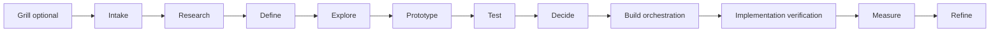

# Design Manager implementation plan

Joe-approved direction, 2026-10-01. TASK AE revised the plan after slice 1
(PR 15) merged; TASK AI applied the stringsaeed stack post before slice 2.
TASK AW applies Joe's 2026-10-02 design sources after slice 2 (PR 24) merged.
The slice-2 entry diagnosis follow-up is implemented at the pure interview
interface and tested by `test/acceptance/design-layer-diagnosis.test.mjs` (AW-2).
Slice 3 now has [settings and an offline-tested cloud qualification harness](settings-cloud.md).
Its live account/background-runtime qualification remains incomplete. Slice 4 now
has the criterion evidence gate (`software-factory/design-verify`, tested by AW-4),
a sample-app VERIFY skill/runner and the [e2e wrapper](../../capabilities/agentic-ui-evaluation/README.md)
with qualified deterministic web execution on e2e 0.16.0. It remains non-blocking.
Model-backed exploration with Joe's attended ChatGPT login remains incomplete.
Later slices remain planned; none is qualified by this text or pure replay.

## Purpose and ownership

The Design Manager is Joe's first app powered by Codex and **app-agnostic
factory infrastructure** for designing all his future apps. It has its own
progress view and per-project design journal inside the factory. It never
lives in, reads from, or writes to DoctorCRE or the CARR record layer.
DoctorCRE is one future project, tested in the final slice after sample apps
qualify the manager.

A product-owned runner reads its repository, detects platforms, drives its app
and supplies permitted development artifacts through a generic receipt interface.
The manager has no product repository mount, product credential, production data
access or deployment authority. Product configuration and verification skills
remain product-owned. Products build, test and operate without the factory.
DoctorCRE's final run uses that same interface; no DoctorCRE adapter, CARR lookup,
direct product write or product runtime dependency is introduced.

## Verified platform facts and runtime choice

Official raw announcement and documentation pages were read on 2026-10-01.
**Verified** means the source documents the capability; account access and this
manager's integration require separate live qualification. **Unverified** marks
a claim not established by documentation or an end-to-end test.

| Capability | Launched / documented behavior | Subscription versus API billing | Status and source |
| --- | --- | --- | --- |
| Codex cloud environments | Reusable environments; tasks continue while the computer sleeps | Plus, Pro, Business, Healthcare, Education, Enterprise; plan allowance applies | Verified: [recap](https://openai.com/index/devday-2026-recap/), [cloud tasks](https://developers.openai.com/codex/cloud), [environments](https://learn.chatgpt.com/docs/environments/cloud-environments) |
| Codex SDK / app server | TypeScript `@openai/codex-sdk` starts/resumes local threads; Python `openai-codex` controls local app-server JSON-RPC with a pinned runtime; custom client integration | Local Codex supports ChatGPT subscription login on eligible plans; API-key execution is separately billed. SDK integration does not establish general subscription app hosting | Verified: [SDK](https://developers.openai.com/codex/sdk), [authentication](https://developers.openai.com/codex/auth), [app server](https://learn.chatgpt.com/docs/app-server), [pricing](https://developers.openai.com/codex/pricing). SDK submission of subscription cloud tasks: unverified |
| Plugins / extensions | ChatGPT and Codex share packaging/directory; sidebar apps, panels, file viewers and forms | Announced for all plans; extension docs say Free/Go web is coming soon and composer mentions are desktop-only | Verified: [packaging](https://developers.openai.com/plugins/build/plugins), [extensions](https://developers.openai.com/plugins/build/extensions), [recap](https://openai.com/index/devday-2026-recap/). Every extension on every Codex surface: unverified |
| Code review | Desktop diff review; automatic cloud first passes on GitHub/GitLab | Recap: all plans. Pricing explicitly includes cloud integrations in Plus; Free/Go rollout needs account verification | Verified: [recap](https://openai.com/index/devday-2026-recap/), [plan details](https://developers.openai.com/codex/pricing). Review does not itself pass a factory gate |
| Security scans | Codex Security Cloud scans GitHub repos, investigates/deduplicates findings and prepares fixes with laptop closed | Pro, Business, Enterprise, Edu; included Daybreak Blue models, no separate API key for this subscription surface | Verified: [recap](https://openai.com/index/devday-2026-recap/). Joe's enabled access and Security SDK entitlement: unverified |
| Agents API / app runtime | Managed Codex harness: sessions, recovery, MCP/tools and hosted sandboxes; computer use added | Related capabilities in Codex/Work: Pro 500, Enterprise. Direct API calls use model/tool/container API rates | Verified: [recap](https://openai.com/index/devday-2026-recap/), [platform overview/pricing](https://platform.openai.com/docs/guides/agents-api). Arbitrary manager hosting under Joe's existing plan: unverified |
| Dot research | Joe's default research seat, subject to availability | Pro / Business Premium in eligible markets; Enterprise/Edu/Healthcare beta needs admin enablement | Verified: [recap](https://openai.com/index/devday-2026-recap/). Programmatic Dot dispatch from this app: unverified |

**Runtime decision:** station runs execute primarily as Codex cloud tasks under
Joe's existing ChatGPT subscription in a published factory-only environment,
continuing without a Mac on. Slice 3 proves task creation, resume, cancellation,
timeout, subscription usage and laptop-off continuation on Joe's account. Use the
documented cloud surface first; local SDK threads must not be called cloud tasks.
No silent API-billing fallback or scheduled cloud routine is permitted.

Tasks are finite background processes. Completion requires checked artifacts and
a journal receipt. The MCP core/journal needs a persistent factory-controlled host
independent of the Mac; disposable cloud workspaces cannot be the canonical store.
Hosting cost/access and programmatic cloud submission remain open qualifications.
If the core is unavailable, retain a bounded result for idempotent import, mark
blocked and never fabricate a completed gate.

Claude remains the judgment seat through its subscription in headless background
mode. No paid Claude API key, Claude Code app session, scheduled task or Claude
cloud routine is used. Headless still requires a running host: Codex laptop-off
execution does not prove Claude laptop-off execution. Slice 3 qualifies an allowed
noninteractive subscription route on a persistent host, including expiry/limits.
Until qualified, dependent judgment gates are blocked; no author self-approval,
paid fallback or claim that every station already runs unattended.

## One core, thin adapters, own store

One core owns contracts, gates and journal commands and exposes **one MCP server**.
Thin Codex and Claude Code plugin adapters translate entry points and display
results; they cannot duplicate gates, maintain separate journals or grant authority.

```text
Factory progress view / Codex plugin / Claude Code plugin
                          |
                   Design Manager MCP core
                contracts + gates + journal
                          |
         factory SQLite database + immutable artifact files
                          |
               supplied product-runner receipts
```

**Codex plugin finding (verified):** the portable layout is root `plugin.json`,
schema `https://agent-plugins.org/schemas/1.0.0/plugin.schema.json`, `skills/`
and `mcp.json` with explicit transport types. OpenAI-specific presentation lives
under `extensions.com.openai`. `.codex-plugin/plugin.json` remains supported;
the current creator scaffolds that compatibility format. Choose the portable
format for the thin adapter. Local marketplace availability varies by surface.
Source: [official packaging guide](https://developers.openai.com/plugins/build/plugins).
MCP plus AGENTS.md/skills is a direct invocation path on a surface without
qualified plugin loading. The Claude Code plugin exposes the same core and
skills; it does not launch app sessions or own an orchestrator. Adapters wait
for slice 7. Optional extensions display the same progress projection, only
after surface qualification; they never become a runtime prerequisite.

**Store decision:** a small embedded SQLite database under the factory's private
state root, partitioned by user/project/version, plus immutable artifact files.
Proposed root: `~/.local/share/software-factory/design-manager/` on the persistent
factory host, containing `journal.sqlite` and `artifacts/`; this is private factory
state outside the source checkout. The same layout serves every app project.
Events, decisions, gates, evidence, worker receipts and provenance are structured
records, never Markdown journals. Transactions, uniqueness constraints, migrations
and indexed progress queries handle concurrent tasks and gate/event atomicity.
Files hold larger screenshots/repros; database refs and SHA-256 digests bind their
bytes. No database, credential or project research is committed to this public repo.

One persistent host owns the database writer, access control, backup and restore
checks. Cloud workers call MCP rather than share SQLite over a network filesystem.
Appends use idempotency keys and expected project revision; conflicts require a
reread. Evidence is archived before cleanup and its digest checked afterward.
Retention and artifact access are explicit per project; no standing product
secret is stored. SQLite beats loose canonical files for atomic updates and
deduplication; a server database waits for measured single-host limits. Nothing
uses CARR storage, CARR Model Room or its record API.

## Five stations and configurable workers

The five stations replace the 14-role relay. Roles become station checklists,
retaining every input/output rubric and stop below. One bounded assignment can
cover several applicable checklists. The manager records omissions and reasons
and enforces tier/gate requirements. `HandoffManifest.role` records checklist
provenance; it is not a hard-coded worker dispatch table.

Workers, model/effort, concurrency, availability and allowed routes come from a
private **per-user settings file**, proposed path
`~/.config/software-factory/design-manager/settings.json`. No credentials are
embedded. Intake binds the resolved profile's version/digest to a run. New settings
affect new assignments without rewriting receipts. Schema-check the file; an
unknown or missing route blocks instead of silently choosing a provider. Joe's
defaults below are editable settings, never constants in station implementation.

| Station | Joe's default allocation | Completion artifact |
| --- | --- | --- |
| Research | Dot (ChatGPT); Grok for X research | Primary sources, patterns, gaps and factual limits |
| Define | Codex structures intake/jobs/flows; Claude subscription judges material choices | Bounded problem/workflow/version contract and next interview question |
| Design | Codex builds concepts/prototypes/contracts; Claude judges choices | Compared alternatives, states, tokens, behavior and acceptance criteria |
| Prove | Fresh Codex worker drives VERIFY/e2e; independent Claude judges evidence | Exact-revision proofs, repros, gate verdict and limits |
| Ship | Codex packages accepted work; fresh reviewer proves changes live; Claude judgment | Independent verdict, closure contract and consumer receipts |

Fast / Thorough / Specialist / Best Available / Efficient-Eco remain modes within
eligible user settings. They cannot weaken rubrics, add a provider or authorize
extra spend. Qualification records the actual model/effort, account route, outcome,
latency and outage behavior. Existing factory workflows remain separate.

The optional up-front **grill uses an interview box with exactly one question at
a time**. Persist each answer before choosing the next. Never batch questions
or confirmations. Resume at the pending question and distinguish unknown from
declined. Tier chips explain the recommendation without becoming a batch interview.

### Entry diagnosis (slice 2 follow-up)

Entry paths select applicable work, not an assumed design maturity. Diagnose in
dependency order: **evidence → domain → need → strategy → model → flow → surface**.
For each layer record its decision, supporting artifact refs, uncertainty,
dependencies and support: strong / partial / assumed / weak / not-started / N/A.
Strong means the named decision meets its declared evidence criterion; partial,
assumed, weak and not-started are unsupported. N/A requires a reason showing
that no in-scope decision depends on it. A confidence score alone proves nothing.

All three steps are required, in order:

1. Assess each layer using supplied evidence and explicit applicability reasons.
2. Select the first unsupported applicable layer and its next unresolved question.
3. Record one answer, then reassess dependencies before selecting another question.

Evidence asks what happened and what contradicts the claim. Domain resolves terms,
objects and authority. Need names an observable outcome without naming widgets.
Strategy selects a bet and its falsifiable assumption. Model specifies objects,
actions, ownership and allowed transitions. Flow includes destinations, refusal,
recovery and work outside the app. Surface selects hierarchy, copy and expression
against that foundation. These are cross-cutting diagnoses within the five stations,
not new stages or permission to skip adjacent lifecycle transitions.

Every next action names the uncertainty it resolves. Unknown/declined stays
unresolved; resume preserves the pending question. New contradictory evidence
invalidates dependent decisions, while retaining the prior decision and evidence.
If every applicable layer is supported, return to the entry's pending work rather
than inventing another interview. A surface request with an unsupported domain
decision routes to that domain question first, without silently expanding scope.
The follow-up supplies layer-assessment types and replay tests at the existing
pure interview interface; [entry-playbooks.md](entry-playbooks.md#layer-diagnosis)
describes the supplied set, reassessment, dependency revisions and history.
Its one-question, tier, scope and resume rules remain binding. This checks reported
evidence/applicability only; live artifact authentication and independent judgment
remain in later slices.

## Contracts first

The existing public import remains `software-factory` (`src/index.mjs`). The typed
contract import is `software-factory/design-manager`. Slice 1 supplies
`src/design-manager.mjs`, its adjacent `design-manager.d.mts` declaration, and
`schemas/design-project.schema.json`. These describe development-time work;
they confer no execution, production, deployment or acceptance authority.

```ts
type DesignStage = 'grill' | 'intake' | 'research' | 'define' | 'explore'
  | 'prototype' | 'test' | 'decide' | 'build-orchestration'
  | 'implementation-verification' | 'measure' | 'refine';
type DesignTier = 'lean' | 'standard' | 'high-assurance';
type WorkStatus = 'active' | 'awaiting-human' | 'blocked' | 'closed';
type GateStatus = 'pending' | 'pass' | 'fail' | 'blocked';
type DesignStation = 'research' | 'define' | 'design' | 'prove' | 'ship';
type ProjectPlatform = 'web' | 'ios' | 'android' | 'desktop';
type ModelMode = 'fast' | 'thorough' | 'specialist' | 'best-available' | 'efficient-eco';
type EvidenceStrength = 'target-user-observation' | 'representative-user-testing'
  | 'domain-expert-feedback' | 'owner-task-testing' | 'heuristic-accessibility'
  | 'competitor-pattern-research' | 'simulated-critique';
interface ArtifactRef { ref: string; digest: string } // sha256 of artifact bytes
interface PersistenceProof {
  writtenValue: ArtifactRef; independentReadback: ArtifactRef; readbackMethod: string;
}
interface VerificationProof {
  sourceRevision: string; platform: ProjectPlatform; method: 'verify-skill' | 'e2e';
  entryPoint: string; entryPointStatus: 'exercised' | 'skipped' | 'blocked';
  outcome: 'passed' | 'failed' | 'blocked';
  actionAndResult: ArtifactRef; persistence: PersistenceProof | null;
}
interface EvidenceRef extends ArtifactRef {
  strength: EvidenceStrength; verification?: VerificationProof;
}
interface RoleContract {
  role: DesignRole; inputs: readonly string[]; outputs: readonly string[];
  rubric: string; stop: string;
}
interface HandoffManifest {
  role: DesignRole; makerId: string; artifact: ArtifactRef;
  evidence: EvidenceRef[]; unresolvedQuestions: string[];
  confidence: number; limits: string[];
}
interface GateRecord {
  gate: DesignGate; status: GateStatus; artifact: ArtifactRef;
  reviewerId: string; evidence: EvidenceRef[];
}
interface VersionContract {
  version: number; includedWorkflows: string[]; exclusions: string[];
  knownLimitations: string[]; blockingDefects: string[];
  acceptanceCriteria: string[]; deferredRefinements: string[];
  evidenceWindow: string;
}
interface DesignProject {
  schema: 'design-project.v1'; projectId: string; sourceRevision: string;
  platforms: ProjectPlatform[]; // nonempty, unique, declared at intake
  entry: DesignEntry; tier: DesignTier; stage: DesignStage; status: WorkStatus;
  versionContract: VersionContract; handoffs: HandoffManifest[]; gates: GateRecord[];
}
function nextDesignStage(stage: DesignStage): DesignStage | null;
function advanceDesignStage(stage: DesignStage, target: DesignStage): DesignStage;
function stationForDesignStage(stage: DesignStage): DesignStation;
function stationForDesignGate(gate: DesignGate): DesignStation;
// inspectProjectPlatforms takes supplied signals; evaluateMobileVerification
// returns a pure precondition; isVerifiedUserPath tests reported eligibility.
// Slice 2: startDesignInterview, answerDesignInterview, resumeDesignInterview,
// proposeDesignScope and inspectDesignInitialization return/check pure snapshots.
// Planned, not executable in slices 1–2:
// route(station: DesignStation, state: DesignProject, settings: UserSettings): Promise<Assignment>
// review(handoff: HandoffManifest, candidate: ArtifactRef): Promise<GateRecord>
// appendJournal(project: DesignProject, event: JournalEvent): Promise<JournalRef>
// projectControlSurface(state: DesignProject, journal: JournalRef): ControlSurface
```

Slice 2's [entry playbooks and interview interface](entry-playbooks.md) initialize
the same project schema at Intake with explicit tier, scope and pending work.
They preserve the standard adjacent-stage path and confer no execution authority.
Slice 4 implements the criterion evidence contract as its own versioned records
(`schemas/design-verify.schema.json`: `design-check.v1`, `design-review.v1`), not as
additions to `VerificationProof` or the project schema. Reference records and the
project design contract below remain specifications for their owning slices. The current helpers
check reported eligibility/initialization only. Slices 4/5 will version stored
contracts and reject older incomplete receipts for acceptance; no compatibility
path may promote today's receipt shape into the stronger proof contract.

### Station checklists: inputs, outputs, rubrics and stops

Station workers consume structured project state and return the handoff above.
Every assignment stops on missing required input, unsupported authority, or an
unresolved consequential risk. Role-specific contract catalogs live in code;
this table is the implementation specification, not a durable project journal.

| Station checklist | Role | Inputs | Outputs | Pass criterion / stop condition |
| --- | --- | --- | --- | --- |
| Define (coordination across stations) | Design Manager | state, tier, scope, evidence, version contract | routing, assignments, progress rail, gate decisions, escalations, continuity | Every stage has owner, artifact, evidence standard and next state; stop hidden scope expansion |
| Research | Research Specialist | problem, domain, users, factual questions | primary sources, pattern inventory, evidence quality, gaps | Source facts and label inference; stop unsupported factual claims |
| Define | Product/UX Strategist | intent, research, business constraints | groups, jobs, outcomes, hypotheses, exclusions, measures | Observable outcomes; stop unbounded feature scope |
| Define | Workflow Architect | job, records, failure history, constraints | current/proposed flows, states, ownership, exceptions | Normal, refusal, recovery, handoff, concurrency; stop missing critical paths |
| Design | Information Architect | jobs, content, terms, retrieval needs | navigation, hierarchy, labels, findability, cross-surface model | Predictable homes and operating language; stop ambiguous authority/home |
| Design | Interaction Designer | accepted flow, authority, platforms | controls, forms, transitions, disclosure, feedback, recovery | Consequence/state/authority visible; stop dangerous ambiguity |
| Design | Prototype Specialist | concepts, devices, test questions | cheapest behaviorally adequate prototype | Answers declared questions; stop production claims |
| Design | Visual-System Designer | brand, components, accessibility, platforms | type, color, spacing, components, tokens, themes, hierarchy | Consistent, distinctive, readable, reusable; stop unjustified generic styling |
| Prove | Accessibility Specialist | flows, prototypes, components, candidate | criteria, manual checks, assistive tests, defects, remediation | Evidence for declared target; stop uncovered critical workflow/state |
| Prove | Usability/Evaluation Specialist | hypotheses, candidate, participants, limits | task scripts, observation protocol, metrics, severity, limits | Measures outcomes without coaching; stop simulated evidence labeled as users |
| Prove | Adversarial Reviewer | artifact, criteria, evidence, risks | assumptions, contradictions, failures, near misses, repairs | Objections answered or explicitly accepted; stop unaddressed consequential risk |
| Ship | Implementation Translator | accepted design, states, tokens, decisions | engineering contract, mappings, tests, references | Bounded implementation choices; stop uncheckable acceptance |
| Prove | Implementation Verifier | approved contract, exact candidate | behavior/visual/accessibility/state comparison | Separate source completion, deployment, activation and consumer proof; stop candidate mismatch |
| Prove | Measurement Specialist | released version, events, baseline, feedback, outcomes | deltas, regressions, ranked opportunities, next cycle | Baseline/window/population/limits; stop vanity or unsupported claims |

### Lifecycle, tiers, gates and authority



Initialization may begin at Intake when Grill is omitted. Within a version,
advancement follows adjacent stages. Refine has no automatic successor: a new
bounded version needs a new version contract. Stage advancement is bookkeeping,
not a gate pass. `status` describes work separately from stage; closure does not
mean deployment or successful acceptance. Future entry playbooks may select a
bounded subset with explicit criteria; this slice supplies only the standard path.

| Tier | Required work |
| --- | --- |
| Lean | concise grill, workflow, one/two concepts, owner testing, accessibility, implementation criteria, post-build review |
| Standard | Lean plus domain research, alternatives, interactive prototype, task evaluation, failure states, measurable baseline, decision record |
| High-Assurance | Standard plus representative users, privacy/threat analysis, formal accessibility, stronger validation, staged release, monitoring, rollback, independent assurance |

A workflow can require stronger assurance than its project. Unknown tier needs
an explicit upward recommendation, never an implicit Lean default. Human tier
selection uses chips showing recommendation, included/omitted evidence, effort
and protected risks. Evidence strengths are ordered as declared above; simulated
critique remains the weakest and must never become a user observation.

| Owning station | Gate | Comparison required |
| --- | --- | --- |
| Define | Problem | intent against observable problem/outcome |
| Define | Workflow | mapped job against owners, states, failures and exceptions |
| Design | Concept | chosen direction against credible alternatives and stated reasons |
| Prove | Interaction | critical task observations against completion criteria |
| Design | System | tokens/components and accessibility evidence against declared system/target |
| Ship | Build readiness | design against user/job, critical flow, tested risk assumptions, concept rationale, loading/empty/stale/failure/conflict/permission states, accessibility, checkable acceptance and post-build evaluation |
| Prove | Implementation fidelity | exact built candidate against accepted design contract |
| Prove | Operational evidence | real task outcomes against named baseline/window/population |
| Ship | Version closure | fixed included scope against acceptance, defects, exclusions, limitations, deferred work and V2 evidence window |

A GateRecord is a reported result, not authenticated certification. Later review
execution must establish maker/reviewer independence and exact artifact binding.
Ordinary repair is bounded to two failed rounds, then manager diagnosis and a
concise human choice. Manager controls sequence, tools, research and routine
repair. Human controls objectives, material tradeoffs, expansion, consequential
exceptions, activation and final acceptance. Challenge ordinary overrides once,
record, then proceed; significant privacy/security/accessibility/data-integrity/
legal/irreversible risks retain stronger confirmation or refusal. Only trust,
safety, data-loss or core-workflow failures reopen closed scope; other findings
enter the next ranked version. No automatic closed-version reopening in slice 1.

Stages remain the original path; station ownership groups work rather than
flattening the lifecycle into a new five-stage sequence:

| Station | Stages owned |
| --- | --- |
| Research | research |
| Define | grill, intake, define, refine |
| Design | explore, prototype, decide |
| Prove | test, implementation-verification, measure |
| Ship | build-orchestration; build-readiness and version-closure gates |

The interaction gate includes the mobile precondition below. An e2e outcome
`passed`, `failed` or `blocked` maps to a reported GateRecord `pass`, `fail` or
`blocked`; `pending` means no completed evaluation. Missing capability is the
specified deterministic `fail`, not a successful skipped check. None of these
reported records authenticates a reviewer or supplies user evidence by itself.

## Prove: VERIFY skill, feature map and proof rules (slice 4)

### Build inner loop and Prove acceptance

**Build means Ship's `build-orchestration` stage**, not an additional station.
The product-owned runner uses simulator/emulator driving and querying tools
(agent-device, argent and stim resource orchestration) in Build's inner loop to
inspect, mutate, debug and iterate. Web uses the same split: browser driving and
querying support development; e2e's web engine supplies acceptance evidence.

For **every user-facing acceptance criterion**, Prove requires e2e behavioral
evidence from the applicable web or mobile engine on the **exact built revision**,
bound to the product-runner build SHA and artifact digest. Map the criterion to
the exercised user entry points, actions, assertions and observed results.
A VERIFY receipt supported only by unit/component tests **fails** that criterion.
A direct dev-loop driver session, screenshot, successful query/mutation or
VERIFY label without the corresponding e2e acceptance evidence also fails.
Unit/component tests remain useful supporting checks; they cannot replace this
proof. Manual usability, assistive testing and other declared evidence still
apply; e2e alone does not settle those verdicts.

The split assigns workflow responsibility, not an upstream capability limit:
agent-device and argent also offer verification/replay features, and e2e's mobile
engine itself uses agent-device. Prove judges the criterion's e2e evidence, never
the driver's identity or its development-session success. Source: the
[practitioner post](https://x.com/stringsaeed/status/2105734077085303106), checked
against [e2e mobile](https://github.com/tester-army/e2e/blob/a0ee3e9061b666fa3dd43e7dcc8e1a5da47362d6/docs/mobile.mdx),
[agent-device](https://github.com/callstack/agent-device/blob/cc5e356595c75e459ed4968c55cedd3d1dbb715d/README.md)
and [argent](https://github.com/software-mansion/argent/blob/a824fcba90f7ebc7ecdb00b4abf4c00d3fba9e42/README.md).

Each product owns a **VERIFY SKILL** and feature map, adapting pstack's pattern
to the product's supported skill directory. Joe adopted pstack/poteto as the
engineering framework on 2026-10-04. Native platform mappings preserve the
per-user vendor-neutral workers and the Codex primary runtime; unsupported
Cursor automations remain dormant. There is an index and one file per
user-facing feature. Each feature
names its entry points, sub-features, user route, driving handles, observable
end state and gotchas. A convenient entry point cannot stand for all listed
entry points. Source: [pstack verification generator at the studied revision](https://github.com/cursor/plugins/blob/c47b12849e43f18d5c374c7069c744cc55b0ea00/pstack/skills/create-verification-skill/SKILL.md).

All five steps are required, in order:

1. **Launch:** use the product's documented command with isolated test data, ports and an owned process.
2. **Doctor:** check readiness, exact revision, process/port ownership and auth before driving; repeat after a failure.
3. **Drive:** exercise the user entry point with stable selectors/commands and declared task goals.
4. **Evidence:** capture action and result, side effects, exact revision and a second independent stored-value read.
5. **Cleanup:** tear down only resources created by this run; retain evidence outside scratch/output directories.

`EvidenceRef.verification` carries the proof receipt; it is optional for research
evidence, required whenever a path is claimed verified. It includes source
revision, platform/method, entry point/status, evaluation outcome, action/result
artifact and persistence proof. Stored writes require `writtenValue`, a distinct
`independentReadback` artifact and `readbackMethod`: for example, save via UI then
read through the product's existing read-only persistence interface. Two copies
of one screenshot are not independent reads. `persistence: null` is allowed only
for a path with no stored-value claim. Prove checks that claim against the feature
map and observed effects; callers cannot omit persistence to avoid the rule.

Proof rules retained from the stack study: use the real user path, re-read stored
values a second way, and **never count a skipped entry point as verified**. Internal
setters/test-only endpoints, final-screen-only captures, stale revisions, missing
readback, failed/blocked outcomes and skipped entry points fail eligibility.
Mocks are allowed only at an existing production boundary; observe what test mode
skips rather than trust its name. Digest fields bind bytes, not truth: Prove must
fetch/read artifacts and verify outcomes, independence and source binding live.

Slice 4 runs Launch through Cleanup once on a small sample app, confirms evidence
survives teardown, then deliberately breaks a mapped feature and confirms failure.
It also exercises skipped paths and forged/stale receipts. The slice-1 pure helper
checks reported eligibility only; it does not drive a browser or certify proof.
Add web and triggered-mobile fixtures where unit/component tests stay green but
the user path is broken. Reject unit-only and direct-driver-only VERIFY receipts;
require the e2e assertion to fail on the broken build and pass on the repaired
build. A `method` string is not behavioral evidence. Criterion-level acceptance
is a slice-4/10 gate responsibility, not a claim made by the slice-1 helper.

### Criterion evidence contract (slices 4 and 10)

VERIFY is a set of criterion-level evidence records, never a compliance stamp.
Before execution, assign each criterion a stable ID and freeze its expectation,
blocking status, required evidence kind, applicable platforms and entry points.
Every check records the criterion ID, fixture ID/revision/digest, actor and starting
state, steps, expected result, observed result, assertion/repro artifact refs and
outcome. Keep failed and blocked observations alongside passing ones. A missing
required row stays pending; a blocked row cannot pass. An aggregate craft score
cannot override a failed blocking criterion or an unresolved required row.

Bind each record to project/version, accepted design-contract revision/digest,
source commit, **immutable build artifact digest**, build configuration and fixture
digests, platform/engine version and inspected target identity. The target
declares one engine per evidence kind on each platform, so an honest manual row
names its inspection method rather than borrowing the e2e engine, and it names
the digest of the build's own feature map, which the frozen manifest must match.
A commit alone does not distinguish two builds with different bytes or configuration. Reviewer
identity, fresh-context receipt and review evidence are separate from maker identity
and self-critique. The core authenticates them and reads the bound bytes; supplied
IDs/digests do not establish independence or correctness. For stored changes,
retain the existing independent persistence readback requirement.

Each check must demonstrate failure: supply at least one deliberately broken
fixture with a known expected violation, run the same assertion/oracle on it and
record detection, then repair the fixture and record success. Manual or judgment
checks use a planted violation and independently documented expected finding;
they are not relabelled deterministic e2e. A check that passes its broken fixture
is disqualified. The frozen defect manifest prevents rewriting expectations to
match the defect. Keep clean refusal/empty-state traps to expose false positives.

Approval compares the candidate's full build identity and contract revision with
every required proof record. Evidence for build A can **never approve build B**,
even at the same source commit. A rebuild, configuration/fixture change or changed
contract creates a new evaluation target and requires fresh candidate-bound proof.
Old evidence remains historical/comparator evidence. Checks for unrelated criteria
need no redesign, but their prior passing records cannot certify the new build.

## Prove: agentic UI evaluation (slice 4, reused in 9–10)

Use `capabilities/agentic-ui-evaluation/` as a factory wrapper around
[TesterArmy e2e](https://github.com/tester-army/e2e). Studied source revision:
`a0ee3e9061b666fa3dd43e7dcc8e1a5da47362d6`; package pin **`e2e@0.16.0`**, Apache-2.0.
Preserve license/provenance; exact companion dependencies are locked during
qualification. TASK AE installed no package. The disposable web qualification
fixture now locks e2e 0.16.0, @e2e-dev/web 0.11.2 and Playwright 1.63.0; its
[runner and status](../../capabilities/agentic-ui-evaluation/README.md) distinguish
qualified deterministic execution from pending attended model evaluation.
Set **`E2E_TELEMETRY_DISABLED=1`** on every invocation, including explore, bug bash,
MCP and replay. Sources: [package/version](https://github.com/tester-army/e2e/blob/a0ee3e9061b666fa3dd43e7dcc8e1a5da47362d6/packages/e2e/package.json),
[license](https://github.com/tester-army/e2e/blob/a0ee3e9061b666fa3dd43e7dcc8e1a5da47362d6/LICENSE),
[telemetry switch](https://github.com/tester-army/e2e/blob/a0ee3e9061b666fa3dd43e7dcc8e1a5da47362d6/README.md).

The product owns e2e as a development dependency, its lockfile, `e2e.config.ts`,
fixtures, scripts and baseline expectations. The factory consumes supplied reports
and repro artifacts, normalizes outcomes and emits evidence/gate records. All e2e
agent critique is labelled **simulated critique**, never target-user observation
or representative-user evidence. `passed`, `failed` and `blocked` are distinct:
auth/startup/tool failure is blocked, a disproved expectation is failed, and a
passed run proves only the named exercised assertions on the named revision.
Accessibility remains **heuristic only**. Formal accessibility, assistive testing
and user outcomes still require their declared evidence; e2e cannot certify WCAG.

### Execution and attended authentication

Agent steps run through the **Codex worker using e2e's supported ChatGPT OAuth
provider** (`e2e/oauth/chatgpt`), on Joe's ChatGPT subscription, never Claude.
This is the chosen supported login route, not a Claude custom executor. Upstream
documents ChatGPT Plus/Pro support and explicitly no Claude subscription support.
The exact model comes from account-discovered available IDs and per-user settings.
Source: [subscription setup](https://github.com/tester-army/e2e/blob/a0ee3e9061b666fa3dd43e7dcc8e1a5da47362d6/docs/subscriptions.mdx).
Upstream support is verified from source; this wrapper's live login and OpenAI
eligibility for this third-party use remain unverified until slice 4. Do not infer
universal third-party billing entitlement from [Sign in with ChatGPT's participating-tool announcement](https://openai.com/index/devday-2026-recap/).

Browser/device OAuth is interactive and stored at `~/.config/e2e/oauth.json`
(or XDG config), outside every public repository. Restrict access to the user;
never copy tokens to Git, cloud task artifacts, logs or PRs. **Model-backed e2e
runs are attended only**, with Joe available for login. This is an explicit
exception to otherwise background Codex tasks: unattended tasks wait at a
blocked attended-evaluation checkpoint instead of hanging for auth or paying an
API fallback. Do not upload the Mac's OAuth file to a cloud environment.

The factory progress view tracks credential expiry/health without token contents.
Before expiry it marks affected evaluations blocked and displays one login action;
`LOGIN_REQUIRED`, missing expiry or a failed refresh health check also blocks
immediately. A watched first run proves the alarm and recovery. Persist the alarm
in the factory journal, never depend on a Mac timer or Claude scheduled task.
Successful automatic refresh does not make interactive recovery unattended-safe.
The unattended laptop-off milestone excludes model-backed e2e and unqualified
Claude/Dot routes; blocked dependencies must be visible and resumable.

The [GitHub PR-comment reporter](https://github.com/tester-army/e2e/blob/a0ee3e9061b666fa3dd43e7dcc8e1a5da47362d6/packages/github/README.md)
stays **off unless explicitly enabled per repository** with authorized publication
and permissions. Archive sanitized evidence before e2e's output directory is
replaced by another run. Sample fixtures contain no client/production data;
screenshots, traces and video need explicit access/retention controls.

### Explore, bug bash, MCP and acceptance

Use [explore](https://github.com/tester-army/e2e/blob/a0ee3e9061b666fa3dd43e7dcc8e1a5da47362d6/docs/explore.mdx)
for focused journeys, [bug bash](https://github.com/tester-army/e2e/blob/a0ee3e9061b666fa3dd43e7dcc8e1a5da47362d6/docs/bug-bash.mdx)
for bounded adversarial charters, and [MCP](https://github.com/tester-army/e2e/blob/a0ee3e9061b666fa3dd43e7dcc8e1a5da47362d6/docs/reference/mcp.mdx)
for open/drive/assert/close session steps. A finding counts **only when its repro
test fails with an assertion on the exact candidate**. A story, screenshot or
navigation/auth crash is not a confirmed bug. Reject an explained non-bug with
the expectation and observation; preserve discarded candidates for audit without
counting them as defects. Isolate concurrent charters' mutable state.

Qualification uses a small app with a frozen defect manifest and false-positive
traps, including intended refusal, empty/lazy state, permission denial and a
new-tab journey. Pass only if **every planted defect is caught with a failing
repro and no trap is flagged**. Missing coverage is failure, not a percentage pass.
Verify the planted bug is returned with its failing repro and an explained non-bug
is rejected. Repair the fixture separately, then show the same repro passes.
Compare run receipts to both broken and clean baselines.

The second run replays the recorded actions with **zero model calls**; count
provider invocations, not cached-step labels. Use deterministic assertions for
this replay: model-judged assertions/extraction are not evidence of zero-call
replay. Exploration is not assumed wholly cached. Sources: [executors/cache rules](https://github.com/tester-army/e2e/blob/a0ee3e9061b666fa3dd43e7dcc8e1a5da47362d6/docs/executors.mdx).
Replay the exact bound repro/test, assert the same outcome, archive evidence and
then clean up. Failure to detect a planted defect, a flagged trap, missing repro,
lost evidence or a nonzero replay model count disqualifies the wrapper. Keep it
a non-blocking pilot until these checks, version compatibility, runtime and an
escape/removal path pass; product-local deterministic checks remain authoritative.

## Deterministic mobile trigger

At intake `DesignProject.platforms` is required, nonempty and unique, with values
`web`, `ios`, `android`, `desktop`. The product-owned detector reads package
dependencies (`react-native`, `expo`), `ios/` / `android/` folders, `app.json`,
SwiftUI imports/usage and `.swift` source paths.
It supplies normalized signals to `inspectProjectPlatforms`; the factory itself
does not read a product repository. React Native/Expo or unqualified `app.json`
conservatively suggests both mobile platforms; explicit app.json platforms and
native folders add detected platforms. `RepositoryPlatformSignals.usesSwiftUI`
or a path ending in `.swift` conservatively suggests `ios`, including sources
outside `ios/`. Swift can also target desktop or other platforms: this signal
requests intake reconciliation, not proof of an iOS deployment target. Detected
platforms absent from intake produce a mismatch and stop advancement until the
declaration is reconciled.
Declared desktop/web platforms are not removed merely because native detection
cannot establish them. Ambiguous platform signals require an explicit resolution.

If platforms include iOS or Android, Prove requires, for **each** declared mobile
platform, simulator/emulator execution of the VERIFY skill **and e2e's mobile
engine**, with exact-revision user-path evidence. The interaction and implementation
fidelity gates cannot pass without these proofs. Until the capability exists,
the gate **fails** with exactly:

```text
mobile verification capability not installed: add capabilities/mobile-verification (e2e mobile engine / agent-device, stim, argent; see docs/design-manager/parked.md)
```

`evaluateMobileVerification` centralizes this pure contract precondition. A passed
precondition only reports supplied proof coverage; the future gate must verify
the installed qualified capability, simulator identity, mobile engine, artifact
bytes and every feature entry point. Missing evidence remains pending; blocked
evaluation stays blocked at the gate. Never treat an empty directory or supplied
capability name as installation proof. The iOS-without-capability test checks the
exact failure message now; skipped/stale proofs and missing methods also cannot
pass. The trigger and each parked tool are in [parked.md](parked.md). Upstream
mobile uses agent-device with iOS simulators/Android emulators; iOS requires
appropriate simulator hosting. Source: [e2e mobile docs](https://github.com/tester-army/e2e/blob/a0ee3e9061b666fa3dd43e7dcc8e1a5da47362d6/docs/mobile.mdx).

### iOS platform pack: SwiftUI Pro

The same reconciled `DesignProject.platforms` trigger selects the iOS pack when
it includes `ios`; SwiftUI/`.swift` detection above resurfaces it through intake.
Build uses the [inner-loop assignment](#build-inner-loop-and-prove-acceptance).
Build and Prove's `implementation-verification` apply `swiftui-pro` alongside
`codebase-design` and `zero-tech-debt`. This is a checklist in the existing
platform capability, with product-owned skill configuration and supplied review
receipts; it adds no station, dispatcher or product repository access.

Use Paul Hudson's [SwiftUI Pro](https://github.com/twostraws/swiftui-agent-skill),
skill name `swiftui-pro`, pinned at
`be297ff80dddec529af1f9b1f1f114aab6c9d11c` (`be297ff`),
[MIT license](https://github.com/twostraws/swiftui-agent-skill/blob/be297ff80dddec529af1f9b1f1f114aab6c9d11c/LICENSE).
Install with `npx skills add https://github.com/twostraws/swiftui-agent-skill --skill swiftui-pro`,
or link the existing local `~/.agents/skills/swiftui-pro` installation into the
product's supported skill directory. The install command follows upstream;
verify the installed `SKILL.md` and `references/` against the pinned revision
before use. A floating/latest install is not evidence of the pin.

Load `SKILL.md` and the applicable references for deprecated APIs, views,
data flow, navigation, HIG design, accessibility (Dynamic Type, VoiceOver,
Reduce Motion), performance, Swift correctness and hygiene. **Review only
SwiftUI code**: an iOS declaration or `.swift` extension activates the pack,
but does not make UIKit-only, server Swift, web or Android code eligible for
this skill. Respect the product's deployment target and conventions; the
skill's defaults do not authorize target upgrades or new dependencies.

Report genuine findings by file and line with the violated rule and a proposed
before/after fix, bound to the exact candidate revision and diff. **Findings on
changed lines are blocking**: Build cannot complete and Prove's implementation
fidelity gate cannot pass until they are repaired and re-reviewed (or an
authorized exception is recorded under the existing authority rules). Findings
outside changed lines remain visible for scoped follow-up. Missing or unverified
pinned skill/review receipts block completion, never count as a clean review.
Skill review is heuristic evidence; simulator, VERIFY/e2e and assistive testing
requirements above still apply. This PR defines the pack contract; execution
and receipt enforcement belong to the planned station slices, not slice 1.
Sibling candidates and their automatic return condition are in
[parked.md](parked.md#ios-platform-pack-candidates).

## Ship independent verdict

Ship requires an **independent verdict before landing**: a fresh agent receives
the accepted contract, exact built revision and live target, independently proves
each change and reads the evidence. Reviewer is never the author; identity and
fresh context are checked, not merely asserted in a manifest. All known fixes
go in **one push**, followed by fresh exact-revision checks/verdict; new findings
restart bounded repair of affected criteria. A changed build requires fresh
candidate-bound proof as specified by the criterion evidence contract; retain
prior evidence as history rather than reusing its approval. Source:
[pstack verify-and-ship](https://github.com/cursor/plugins/blob/c47b12849e43f18d5c374c7069c744cc55b0ea00/pstack/docs/guide/06-verify-and-ship.md).
Ship recommends readiness, never grants merge/deployment authority. For TASK AW,
one ordinary PR is delivered with green CI; this session never merges it.

## Prove maintenance (slices 9–10)

Slices 9–10 run a VERIFY-skill maintenance pass before task evidence. Outcomes are
**clean / changed / blocked**. It may edit only verification skills, helper scripts
and the feature map; **never product code**. Run Doctor and compare current routes,
selectors and entry points with the map. If the app works through its current
user route but the map is outdated, update the map and report changed. If the
mapped intended behavior fails in the running app, report a product defect with
failing repro; do not repair it inside maintenance. Missing auth/build/host or
unresolved intent yields blocked, not a speculative map edit. Re-run corrected
verification instructions and preserve evidence through cleanup. Source:
[pstack maintenance](https://github.com/cursor/plugins/blob/c47b12849e43f18d5c374c7069c744cc55b0ea00/pstack/skills/maintain-verification-skill/SKILL.md).

## Own progress view and tool contracts

The factory view projects station/stage/gate, tier/included evidence, current
worker/model/effort, artifact, pending interview decision, scope/exclusions,
evidence strength, tests, review/repair, blocked reason, deferred improvements and
next cycle from its own journal. Default view shows one artifact, immediate
decision and recommendation; detail stays collapsed. It needs a progress visual,
dark cinematic treatment, keyboard/focus/reflow/contrast/target sizing,
screen-reader semantics, reduced motion and error/recovery evidence, with WCAG
2.2 AA as the declared target. Heuristic e2e is not compliance certification.

FigJam serves flows/synthesis; Figma serves native editable canvases/systems;
HTML/browser prototypes serve behavior and realistic states. Production work
starts after build readiness. Existing implemented truth reaches the manager
through product-supplied artifacts; Figma changes design intent only through an
accepted version. Claude Design remains an explicit optional human-visible
handoff in the penultimate tool slice. No app-session automation is introduced.
Access/login, extra cost, publication, destructive replacement and material
direction changes retain their human boundary.

### Reference evidence records (slices 5 and 8)

Research references are structured journal records partitioned by project/version.
Each has a stable ID, original source URL/author, source revision when available,
source date and inspection/capture date, platform/viewport/state and artifact refs.
Label evidence **still / recording / live / inspected-source / vendor-claim**;
missing access remains explicitly unverified. Distinguish observed property from
inference, and retain the user decision, borrowed property, proposed adaptation,
mismatch, rejection test, reviewer outcome and license/reuse status. Link sources;
copy code/assets only after reuse rights are verified. Generated concepts and
reconstructed examples retain those labels, even when attractive.

Evidence level limits the claim: stills establish appearance, recordings depict
bounded transitions, operated live examples establish only exercised behavior,
inspected source establishes implementation facts, vendor claims remain claims.
None approves the target build. A pictured copy/save control proves no copy/save
outcome. A blocked gallery or paid unseen prompt supplies no inspected mechanism.
Record experiment → failed property → replacement rather than dropping rejected
references. Restore must preserve these records and their artifact digests.

Design selects a small task-relevant comparison set. Hold task, synthetic content,
viewport and starting state constant; vary a named hierarchy, layout, density,
interaction or expression hypothesis. Anchor feedback to build/variant and stable
element identity, with observation, consequence and requested change. A hybrid
winner must rerun the same tasks; its ingredients' scores cannot approve it.

### Project design contract and state-first critique (slices 8–12)

Each project owns one accepted, immutable design-contract revision with a digest,
scope, decisions, provenance and explicit exceptions. It combines semantic tokens
(roles, values and platform mappings), usage rules (meaning, permitted variants,
responsive behavior and exclusions), component/state fixtures and accessibility
criteria. A token value without its meaning or state rule is incomplete. A
project's system does not become the factory's global theme. Order conflicts by
task/approved system, truthful behavior/accessibility, chosen method, then recipe
defaults; consequential exceptions retain the existing authority rules.

Before code, enumerate the scoped state list: initial/intermediate/final,
loading, empty, partial, stale, denied, failure, timeout, unknown outcome, conflict,
cancellation and recovery, with explicit N/A reasons. Each action names its object,
owner, allowed transition, destination and observable consequence. Include a
motion/state contract for each transition: **trigger, source identity, states,
authoritative completion event, interruption, reversal, focus and reduced motion**,
plus timing/property ownership and teardown. The no-motion route preserves the
same task and information. Animation completion never certifies persistence;
unknown server outcomes require reconciliation rather than an assumed rollback.

Slice 8 freezes this list and named review criteria before build readiness.
Slice 9 renders the actual prototype and performs bounded self-critique before
independent review. All four steps are required, in order:

1. Render the identified candidate's relevant states, transitions and failure paths.
2. Score named criteria with observations and artifact refs, including hard failures.
3. Fix the three worst evidenced problems, or all remaining problems if fewer.
4. Rerender affected states and repeat until every threshold and hard criterion passes.

Criteria include task clarity, readability at target size, hierarchy, state truth,
recovery, accessibility, system fidelity and motion continuity where applicable.
Freeze anchored score descriptions and thresholds before rendering; craft scores
use an 8/10 minimum with a described meaning, never round a borderline score up.
No average hides a failed criterion. Keep each round's build identity, scores,
three selected defects, fixes and new evidence in the journal. The existing
two-failed-round repair limit still applies: reaching it stops for diagnosis and
escalation rather than an unbounded “repeat until good.” Scores are simulated
critique, not user evidence. The fresh reviewer receives contract, rubric,
reference evidence and candidate without the maker's scores; it reruns checks
and can fail a self-scored pass. Self-critique cannot advance Ship.

For motion/video artifacts only, adapt the course's deterministic seek/draw method:
seed variation, seek frames without timer dependence, compare repeat-render hashes,
inspect a contact sheet/fast-action strip, target-size readability and loop seams.
A continuous live app recording and a deterministic rendered film remain distinct.
Use supplied product captures when depicting implemented UI; invented screens
must be labelled concepts. Aspect-ratio exports preserve layout through explicit
layout rules, not blind crops. Audio/beat criteria apply only when in scope.
No video engine, mandatory motion library, subagent pipeline or marketing service
is introduced by this plan.

The **same revision/digest** feeds slice 11's Figma pilot, slice 12's optional
Claude Design packet and slice 10's implementation review. Figma variables,
components and state frames map to contract IDs; Claude receives that contract,
state list, bounded reference packet and unresolved questions. Derived exports
record their own digest and parent revision. Tool edits are proposals until
accepted as a new revision; they cannot silently change the contract. A second
screen/component round-trip checks computed values, usage, responsive behavior,
states and motion against the accepted revision. Reading the same spec or exporting
successfully does not establish compliance. Mismatched revisions block review.

### Capability-aware adapter contract (slice 7)

Keep ordinary MCP commands, authorization, gates and journal authoritative.
Adapters negotiate and record host/version/transport/capabilities and qualify
operations on the actual surface. Optional workspace/thread/file entry points,
display modes, deep links, selected context, mentions, settings and typed forms
translate core results. Missing support falls back to ordinary commands and
one-question text/resource-ref input without losing answers, drafts or pending work.
No capability declaration, installed manifest, read-only hint or host metadata
grants access or proves runtime invocation.

Selected evidence is a removable, revision-bound view of canonical records,
not durable history or approval. Test clearing, remount, rapid selection, late
responses, two-thread/project isolation, stale-version saves and unsubscribe/cleanup.
Only permitted supplied artifacts are opened; opaque URIs are not filesystem paths.
Registered-host forms require a separately qualified response-correlation,
pause/resume/cancel/reconnect lifecycle; a legacy helper is not qualification.
Adapter packages pin reviewed schemas and keep core validation identical for
typed and suggested values, including unknown fields, omission and cancellation.

With **every host-specific extension disabled**, ordinary MCP must still initialize
a sample project, persist/resume one question, inspect supplied evidence, request
review, read the verdict and project progress. Optional rich controls disappear;
the core workflow and all authorization/gate results remain the same. Test this
against both rich adapters, malformed/unsupported capabilities and denied access.
Host theming applies to adapter containers, not an automatic project-theme rewrite.
Publish/install qualification checks exact source and built bytes, uses those same
checked artifacts without rebuilding, and proves fresh installation; publication
still needs separate authority. No adapter code is implemented by TASK AW.

## Ordered slices and verification

Each slice must pass on small sample apps before proceeding. Use a synthetic web
task app and an unrelated catalog app; include mobile declaration fixtures from
slice 1 and simulator samples once the mobile trigger fires. No real product or
client data is needed. Slice 13 is the first full DoctorCRE run. Sequence brings
independent review/testing, prototypes and implementation proof ahead of Figma
and Claude Design. Slices 4, 9 and 10 retain their requested numbers.

| Slice | Deliverable | Artifact read / compared against | Failure condition |
| --- | --- | --- | --- |
| 1. Contracts (merged; AE extensions only) | lifecycle, tiers, checklist catalogs, handoffs/gates/version schema; stations, platforms, proof receipt and pure mobile precondition | actual public contract module/declarations/schema and sample fixtures against original catalogs, station/gate tables, malformed cases and baseline npm tests | renamed/lost rubric or stop, schema/type drift, invalid jumps, missing platforms, skipped/stale proof passes, iOS missing capability does not fail with exact message, regression |
| 2. Entry playbooks (merged; diagnosis follow-up implemented) | existing entry paths and one-question grill; lowest unsupported layer diagnosis | initialized states/interview trace against required artifacts/tier criteria; layer assessments and dependency invalidation against AW-2 below | omitted critical work, batch interview, silent Lean default, hidden scope expansion, surface work conceals unsupported lower layer |
| 3. User settings and Codex cloud qualification | configurable station workers/modes; Joe profile; qualified background subscription runtime and dependent-seat routes | resolved settings, actual task IDs/model/effort/usage/resume/cancel/timeout results from a laptop-off sample task against source docs and eligible route baseline | hard-coded seat, API billing fallback, local execution called cloud, lost result, hidden blocked Claude/Dot route, unqualified entitlement or expiry recovery |
| 4. Independent review, VERIFY and agentic UI qualification | maker/reviewer/tester independence, bounded repair/escalation; criterion evidence contract; product VERIFY/map; e2e explore/bug bash/MCP wrapper | frozen planted-defect/trap manifest, broken/clean app outputs (including unit-green broken user paths), criterion-to-e2e assertions on the exact build SHA/digest for web and triggered mobile, failing repros, independent reviewer context, archived proof after cleanup and second-run model-call count; AW-4 | user-facing criterion has only unit/component tests or dev-loop driver evidence, missing exact-build e2e behavioral evidence, author approves self, any check cannot detect its broken fixture, any defect missed, any trap flagged, non-bug accepted, no failing repro, build A approves B, lost evidence, model call during replay, third failed automatic repair, missing escalation |
| 5. Factory Design Journal | SQLite records, reference evidence records, immutable artifacts, MCP-ready commands, project isolation and restore | actual written/read-back/restore records and digest-addressed bytes against decisions, idempotency/revision conflicts, scope and evidence labels on sample apps; AW-5 | provenance loss, evidence label promoted beyond observed scope, cross-project access, transcript dependence, conflicting authority, public/private material committed, incomplete restore |
| 6. Own progress view | lightweight browser supervision and one-question interview box | rendered/task-observed sample state against journal projection, comprehension and accessibility criteria | false station/gate/expiry status, unclear decision, missing progress visual, batch question, accessibility/trust failure, added cognitive load |
| 7. Capability-aware MCP core and thin plugin adapters | one contracts/gates/journal server; portable Codex package and Claude Code plugin; optional negotiated host extensions | actual MCP request/response and install/invoke receipts on supported surfaces against same core command results and declared schema; extension-free workflow and AW-7 | duplicate gate/store, core requires host extension, lost answer/draft, unqualified plugin loading, app session created, paid key, authentication leak, surface mismatch |
| 8. Design synthesis and build readiness | station checklist orchestration, controlled alternatives/reference adaptations, project design contract, state list before code, translator and acceptance contract | sample-app design artifacts against all retained rubric/stops, gate table, credible alternatives and AW-8 | omitted required checklist, unchecked system/flow, missing usage/state/motion rule, reference promoted to proof, generic unjustified styling, uncheckable acceptance, scope drift |
| 9. Behavioral prototypes and usability scripts | coded task behavior; render/score/fix-three loop before independent review; reuse qualified e2e; VERIFY maintenance; task scripts per tier | live sample prototype, critique rounds and scripts/observations/screens against named thresholds, declared states, clean/changed/blocked maintenance results and prior baseline; AW-9 | missing critical state, self-score substitutes for review, below-threshold candidate advances, unbounded repair, stale map confused with product bug, maintenance edits product code, production claim, coached discoverability, simulated critique labelled users |
| 10. Implementation verification | criterion evidence contract against accepted project design contract; exact-build e2e, independent live verdict, VERIFY maintenance and triggered mobile | accepted contract and every criterion versus immutable product-runner build identity, fixture/expected/observed records, web/mobile assertions, exact deterministic check outputs, live comparisons and deployment/activation/consumer receipts; AW-10 | unit/component-only or dev-loop-driver-only acceptance, missing exact-build proof, build A approves B, contract mismatch, stale passing check, heuristic accessibility claimed formal, missing mobile evidence, self-verdict, unproven consumer behavior |
| 11. Figma pilot | native draft create/edit, FigJam, live-screen capture, components/variables/auto layout from the shared project design-contract revision | editable native artifacts on sample apps against source screen, semantic tokens/usage/component/motion states, operation checklist and AW-11 | contract drift, any required capability unproved, duplicate work without measured value, upgrade without proved plan blocker |
| 12. Claude Design handoff | optional visible human handoff, retaining the same project design-contract revision and source binding | artifact refs/digests and acknowledgments against declared task/subscription route, state/reference packet and AW-12 | revision mismatch, app automation, paid API, lost provenance, unapproved publication |
| 13. Full DoctorCRE design cycle | full lifecycle, exact candidate verification, measurement and bounded next version after manager qualification | product-owner supplied baseline/candidate receipts, task observations and measurement records against chosen real-work task set and accepted contract | no measured improvement, unresolved trust/safety/core failure, direct DoctorCRE/CARR access, product runtime dependency, nonreconstructible proof |

### TASK AW acceptance scenarios per affected slice

AW-2 is implemented in `test/acceptance/design-layer-diagnosis.test.mjs`. AW-4's gate
rules are implemented in `test/acceptance/design-verify.test.mjs` with synthetic store
records; the sample-app run is `test/acceptance/verify-sample-app.test.mjs`. AW-4's live
e2e qualification and the other rows remain future slice acceptance tests. Use
both unrelated synthetic sample projects and the existing mobile trigger when
applicable. Each row requires its passing case and deliberately failing case;
retain the actual artifact/observation, expected outcome and source binding.

| Test / slice | Passing case | Required failure or adversarial case |
| --- | --- | --- |
| AW-2 / entry follow-up | On every entry path, a fully assessed layer set selects the lowest unsupported layer; one answer persists and JSON resume returns the same pending question; all-supported returns entry work. Contradictory domain evidence invalidates dependent model/flow/surface decisions without losing history. | A surface request cannot skip weak domain evidence. Assumed evidence or an unjustified N/A cannot certify support; unknown/declined cannot advance; batch questions, missing layers, stale dependency assessments and altered trace fail replay. |
| AW-4 / VERIFY | Each criterion/check has a frozen ID, fixture, expectation and observed result on the immutable candidate; authenticated independent review reads the evidence. The same oracle catches its broken fixture and passes the repaired one; clean traps stay clean. | Mutate one fixture per check, including manual/judgment checks, and require detection. Reject missing expected/observed rows, forged reviewer/fresh-context receipts, maker self-approval, skipped/blocked rows, aggregate pass over a critical failure and build A evidence submitted for B at the same commit. |
| AW-5 / journal | Create, read back and restore records for every evidence label with source/date, borrowed property, adaptation, rejection test, limits and reuse status; records and digests survive cleanup/restart and project isolation. | Omit source/date/label/adaptation/rejection test; mislabel a generated still as live; substitute source bytes; lose rejected experiments during restore; cross-project reads and stale-revision/idempotency conflicts fail without corrupting records. |
| AW-7 / adapters | Disable every host-specific extension and complete initialize → answer/persist/resume → inspect evidence → request review → read verdict/progress over ordinary MCP. Rich Codex/Claude adapters give the same authorized core results; exact checked package survives fresh install. | Missing/partial capabilities, malformed payloads and denied access never bypass core checks or strand work. Test two threads, clearing/remount, late selection/save replies, invalid forms, cancellation and registered-host reconnect/duplicate response; no lost draft, stale context resurrection or unreviewed rebuilt package. |
| AW-8 / synthesis | Freeze state list before code; compare meaningful variants on identical tasks/content/conditions; review one complete semantic-token/usage/component/motion contract. Rerun the synthesized winner and preserve anchored feedback and rejected reference properties. | Missing failure/recovery state, token-role drift, motion with no interruption/reversal/focus/reduced-motion rule, false completion, color-swap-only alternatives or a hybrid accepted without retest blocks readiness. A still/recording/vendor claim cannot count as target behavior proof. |
| AW-9 / prototype | Render actual states; score named criteria; fix the three worst (or remaining fewer); rerender to every frozen threshold, then independently review without maker scores. Repeated input, Escape, slow/failing data, reload and no-motion retain identity, drafts and focus. | Seed three ranked defects and require fixes/new evidence, not score edits. A critical failure or score below 8 cannot be averaged/rounded away. Stop after two failed repair rounds; independently fail a fabricated self-pass. For motion media, unseeded repeat hashes, unreadable target-size frames and a bad loop seam fail their declared checks. |
| AW-10 / implementation | Read accepted design-contract bytes and exact built candidate; compare computed tokens/usage, behavior/states/motion and every criterion's expected/observed evidence, including independent stored-value readback. | Reject wrong contract revision, changed build/configuration/fixture digest at the same commit, stale checks, incomplete state coverage or missing per-check broken-fixture qualification. Build A proof never approves B, including B that looks identical in a screenshot. |
| AW-11 / Figma | Native variables/components/state frames map to the accepted contract IDs/revision; a second screen round-trips semantic values, usage, responsive rules and motion/state intent into implementation review. | Change a token value, usage rule or component state in the derived artifact; drift or missing editable capability is detected. A successful export, interpreted style sample or re-skinned mock cannot certify fidelity. |
| AW-12 / Claude Design | Human-visible bounded packet and acknowledgment retain the exact contract revision/digest also used by Figma and implementation review, state list, reference labels and unresolved questions. | Swap the contract after packet creation or lose a parent/source digest; reject review until a new accepted packet is acknowledged. Copying another app's identity, automating an app session or treating delivery as acceptance fails the contract. |

Slice 13 retains the prior final-run task set: priorities, condition/commitments/
next action, authoritative retrieval, commitment capture/assignment and one visual
automation. The product owner selects and runs tasks; the manager receives bounded
sanitized observations. Measure timing, completion, errors, retries, recovery,
explanation, reversals and confidence; protect commitments, ownership, provenance
and task completion. Capture metadata rather than sensitive bodies or indiscriminate
replay. Test-mode capture needs visible consent, purpose, access and retention.
Statistical A/B claims require randomization, power, trustworthy telemetry and
predeclared metrics. Weekly triage, then monthly triage/quarterly UX review remain
process requirements, not authorization for scheduled tasks in this PR.

## Scope, provenance and open questions

`createFactory().run(job, adapter)` and existing build/index capabilities stay
unchanged. Slice-1 contracts use the existing typed import and pinned Ajv schema
checks; no universal enforcement framework, dispatcher, journal, plugin, browser
runner or e2e package is built now. The new required platforms field is an early
contract revision within `design-project.v1`; no deployed journal migration or
existing stored consumer was found in this repository. Later persistence must
version migrations explicitly. Role catalog names remain checklist provenance.

This plan replaces the prior DoctorCRE-first placement and CARR source/store
assumptions under Joe's explicit TASK AE direction. Public source studies link
upstream instead of copying code. pstack is MIT, studied at
`c47b12849e43f18d5c374c7069c744cc55b0ea00` ([license](https://github.com/cursor/plugins/blob/c47b12849e43f18d5c374c7069c744cc55b0ea00/pstack/LICENSE)).
The [shared X post](https://x.com/stringsaeed/status/2105734077085303106) and its
[quoted e2e announcement](https://x.com/o_kwasniewski/status/2105675143464763540)
were read in full from the saved verbatim copy at
`/Users/booko/carr-system/out/orch/evidence/stringsaeed-post.txt`, retrieved via
Grok on **2026-10-02**. That private evidence file is not committed. The post
reports one practitioner's experience, not measured fitness for this manager.
Raw upstream files confirm documented capabilities; reliability, relative speed,
authoring cost and the composed stack need the live qualification below and in
[parked.md](parked.md). Existing mobile triggers, per-tool qualifications and
pstack vendor-neutral worker, product ownership and runtime constraints remain
in force after Joe's 2026-10-04 framework adoption. The native port source is
`/Users/booko/carr-system/out/orch/pstack/src`; the vendor location after merge is
`/Users/booko/carr-system-pstack/plugins/pstack`. Adoption does not qualify a
particular host, provider route or Cursor scheduled automation.

### Post applications before slice 2

For each claim, ask what the source achieves that the current plan cannot prove,
then add the missing requirement or cite the exact existing requirement. No
mobile stack is installed or qualified by this amendment.

| Source claim | Gap and concrete application / property test |
| --- | --- |
| pstack plus e2e made mobile verification reliable; prior verification was unit-heavy | The plan did not explicitly fail unit-only acceptance. Prove now requires criterion-bound e2e behavior on the exact build; slices 4/10 reject unit-green broken paths and driver-only receipts. Reliability remains unproved until defect/trap fixtures pass. Upstream pstack asks for real-app driving; the reported unit-heavy result describes this practitioner's use, not the skill's documented standard. |
| agent-device/argent support development, e2e proves the feature | No explicit Build/Prove responsibility split existed. The new inner-loop section assigns direct query/mutate/browser driving to Build and e2e acceptance to Prove, including web as the lateral application. Driver success cannot stand in for acceptance. |
| pstack handles most work; stim orchestrates/warms sims; agent-device queries; argent queries/mutates faster | The separate parked candidates did not specify this composition or measure its speed. It is now the first mobile configuration to qualify, with matched query/mutate latency and cold/warm pool measurements. Joe adopted pstack/poteto on 2026-10-04. Use its native port within per-user vendor-neutral stations and the Codex primary runtime; every executable route still requires its fixture qualification. |
| Hand-built Maestro flows were too costly to be practical | Coverage/reliability alone missed implementation effort. The parked comparison now includes timed authoring and maintenance after a controlled feature change; the report motivates that test without predetermining its winner. |
| MiniSim is recommended | The recommendation's provenance was missing. It is now cited in the parked row. Unattended adoption remains declined: a menu-bar GUI launcher fails the headless background runtime property test; optional human tooling retains its exact trigger. |
| The workflow looks promising while efficiency remains unsettled | This plan cannot claim an efficient composed stack today. Qualification records latency, startup and authoring/maintenance cost alongside detection, clean-code acceptance and cleanup; promising is not a passing receipt. |
| Quoted post: open source; deterministic and agentic APIs | Already specified exactly: “package pin **`e2e@0.16.0`**, Apache-2.0” in [agentic UI evaluation](#prove-agentic-ui-evaluation-slice-4-reused-in-910), “Agent steps run through the **Codex worker using e2e's supported ChatGPT OAuth provider**” in [execution](#execution-and-attended-authentication), and “Use deterministic assertions for this replay” in [acceptance](#explore-bug-bash-mcp-and-acceptance). The deterministic web fixture is qualified on 0.16.0; attended model execution and mobile remain unqualified. |
| Quoted post: web, mobile and more; any app | Web/mobile engines are documented; generic any-app coverage is unproved. The exact existing mobile requirement is “simulator/emulator execution of the VERIFY skill **and e2e's mobile engine**” in [mobile trigger](#deterministic-mobile-trigger). This amendment makes web acceptance equally explicit. Other platforms need their own supported-engine fixture before any coverage claim. |
| Quoted post: bring your own agent/infrastructure; local or CI execution | Configurable workers and product-owned fixtures already exist in the plan: “Workers, model/effort, concurrency, availability and allowed routes come from a private **per-user settings file**” and “The product owns e2e as a development dependency, its lockfile, `e2e.config.ts`, fixtures, scripts and baseline expectations.” Upstream [README](https://github.com/tester-army/e2e/blob/a0ee3e9061b666fa3dd43e7dcc8e1a5da47362d6/README.md) and [mobile CI](https://github.com/tester-army/e2e/blob/a0ee3e9061b666fa3dd43e7dcc8e1a5da47362d6/docs/mobile-ci.mdx) document the routes. These sentences do not prove local/CI execution: slice 4 must produce the same fixture's local and hosted-CI receipts on the chosen authorized infrastructure, preserving attended-auth and no-paid-fallback constraints. |

### Joe's 2026-10-02 design sources: property-by-property application

TASK AW read all four supplied Dot reports in full: **080-R-study-nurijanian**,
**081-R-study-tonysimons**, **083-R-study-heydetya**, **084-R-study-abmankendrick**,
and the supplied **0xmovez.txt** course outline. The outline is a relayed study,
not this session's first-hand reading of the full article or linked repositories.
The reports' capability, license, effectiveness and access claims remain proposals
or attributed findings; no catalog, SDK, component, pack or engine was installed
or qualified here. Private reports stay outside this public repository. Public
links below preserve provenance without copying source implementations.

For each family, ask: what exact property does the source demand; does main's plan
specify a falsifiable test for it; what must change? Similar vocabulary is not a
passing test. Consolidation below keeps conditional methods from becoming an
unbounded requirement to implement every catalog recipe.

| Report / source proposal | Test against the main plan and disposition |
| --- | --- |
| 080: [Layers](https://github.com/jamiemill/layers-skills/tree/main/skills), research/domain/need/strategy/model/flow/surface methods; evidence-grounded PM briefs and prioritization | Main's “Persist each answer before choosing the next” does not choose the lowest unsupported decision. Adopt layer diagnosis and dependencies in slice 2 follow-up. Research/strategy methods are conditional ways to answer a named gap, not mandatory surveys or invented numeric rankings. AW-2 tests a surface request with weak domain evidence. |
| 080: [Design and Refine](https://github.com/0xdesign/design-plugin/tree/913a7ab2ac7e0f48eab77c93f2f5376150864b02), controlled alternatives, anchored critique, deliberate synthesis and cleanup | Main asks for “credible alternatives” without equal comparison conditions or stable feedback targets. Adopt controlled comparison, reference/experiment records and hybrid retest in 5/8/9. Main already requires “Evidence is archived before cleanup and its digest checked afterward”; AW-5 adds rejected-reference restore coverage. |
| 080: [Taste](https://github.com/Leonxlnx/taste-skill/tree/ce26fc25c0e5e8cab638f883de62d9a86ee5e45b), [Hallmark](https://github.com/Nutlope/hallmark/tree/13ac0ec7e148655948100b6396439e481361d690), [MengTo](https://github.com/MengTo/Skills/tree/d5bd3a7e9c9f4b00853e84fffa60bc38eee9e744) visual catalogs, media/asset methods, preservation and reusable mechanisms | Main lists “workflows/states/tokens” without usage rules or a shared revision. Adopt the project contract and state-first comparison in 8/11/12. Layout, type, depth, chart, navigation, interaction, rendering, GPU/3D and atmosphere recipes remain conditional hypotheses: require a named job/brand purpose, truthful representation, rights and measured target-device budget. AW-8/9/11 test actual state/geometry/fidelity rather than catalog membership. |
| 080: atomic review contracts, consolidated findings, portable adapters and tests that fail | Main's one broken feature does not prove every check detects its violation. Adopt per-check broken/repaired fixtures, hard failures before scores and authenticated exact-build proof in 4/10; capability qualification in 7. Findings retain location/state, consequence, repair and retest even when deduplicated. |
| 080: [PM resource methods](https://www.prodmgmt.world/resources), metrics, assumption tests, communications and lateral uses | Main already requires “Baseline/window/population/limits” and forbids vanity metrics. Adopt source-linked contradictions, task-based reference/experiment records and falsifiable bets in 2/5/8. A release explanation derives from accepted build facts, not work volume. Statistical inference, procurement, migration and brokerage applications outside the manager fail the task/authority test here. |
| 081: [MCP extensions](https://github.com/openai/mcp-extensions/tree/ca16cb3bc015baaa1b849082d8755bbef18770cb), negotiated entry points, context, resources, forms and settings | Main calls extensions optional but has no extension-free workflow test. Adopt capability-aware slice 7 and AW-7. Selected context is removable and revision-bound; authorization, journal and answer validation stay in the core. Published support and legacy helpers do not qualify an installed host or registered transport. |
| 081: example draft/view/save separation, representation fidelity, bounded imports and exact-artifact release | Main has revision/idempotency requirements but no late-view/context test. Adopt late-response, remount, conflict, cleanup and package-byte/fresh-install scenarios in 7; derivative/source distinction in 5/8. Reject importing a local example store as the authoritative multi-project journal. |
| 083: [Refero](https://styles.refero.design/), [OpenDesign](https://github.com/nexu-io/open-design/tree/main/design-systems), [Neuform](https://neuform.ai/learn), tokens plus usage and revisioned design packages | Main's tokens and source binding cannot detect conflicting prose/component mappings across Figma/Claude/code. Adopt one project contract with rules, component fixtures and provenance in 8/11/12; compare computed styles/behavior and a second screen. Interpreted styles and extracted DESIGN.md remain proposals until those tests pass. |
| 083: [EvilCharts](https://evilcharts.com/docs), [Bencho](https://bencho.dev/), [Rewamp](https://github.com/palakonweb/Rewamp-UI), [Inspora](https://www.inspora.design/), narrow component qualification and failed experiments | Main has state/accessibility checks but no borrowed-property/rejection record. Adopt that record in 5/8 and actual slow/failure/cancel/retry/keyboard/no-motion tests in 9/10. Component adoption remains conditional on workflow, data/units/source fidelity, license and device budget; no chart, cursor, animation or backend is inferred from a demo. |
| 084: [60fps](https://60fps.design/), [Design Spells](https://designspells.com/), [Recent](https://recent.design/), [CollectUI](https://collectui.com/), [Viewport](https://viewport-ui.design/), recorded flows and cause-specific states | Main says “loading/empty/stale/failure/conflict/permission states” but lacks evidence-level constraints and motion interruption tests. Adopt labelled references and complete transition contracts in 5/8; context/focus, repeated-input and recovery scenarios in 9/10. A recording does not prove its pictured control or backend works. |
| 084: [Zajno](https://motion.zajno.com/) and [Motionin](https://www.motionin.design/), easing/delay/fade/morph/mask/depth/parallax/zoom | Main's reduced-motion requirement lacks trigger/completion/interruption/reversal/property ownership. Adopt motion/state contracts in 8/11/12 and same-task immediate/no-motion comparisons in 9/10. Each technique must preserve identity, readable information, precision targets and task access; none is universally required. |
| 084: [SeeSaw](https://www.seesaw.website/), [Posts.design](https://posts.design/), unavailable/gated gallery material and presentation references | Main stores provenance but does not bound reference claims by observation. Adopt source/date/label/availability/rejection records in 5/8. Communication may borrow grammar with truthful released facts and cleared assets; popularity, an unavailable listing or promotional art fails behavioral-proof eligibility. |
| 0xmovez: [course outline source](https://x.com/0xmovez/status/2104216919033192746), state list, render/score/fix-three loop, deterministic frames, references and formats | Main requires state coverage and bounded repair, but no pre-code state list or thresholded self-critique. Adopt state-first/critique in 8/9, revisioned grammar in 5/8/11/12, conditional deterministic-render/contact-sheet/size/seam tests for motion media in 9. Film pacing, sound/beat grids, springs and multi-format layout are tools only for an in-scope motion artifact, not universal app UX laws. |

Declines apply to literal requirements or unqualified transfers, not to whole
sources. Each needs a failed property test before it can return:

| Declined item | Source | Specific failed property test / return condition |
| --- | --- | --- |
| Product-specific screens, record access, brokerage tasks or global brand prescriptions | 080/081/083/084 | App-agnostic/authority test: the manager must operate on unrelated samples with supplied receipts and no DoctorCRE/CARR access. Product owners may adapt ideas privately through the generic interface. |
| Wholesale visual presets, fixed quotas, forced novelty/font/color/spacing/motion bans, dashboard exclusion or automatic broad redesign | 080; 083; 0xmovez house style | Coverage/scope/fidelity test: the method must preserve an in-scope task, accepted system, dense states and usable fallback. Conditional techniques may return after matched-task comparison; source taste is not global policy. |
| Fake activity, simulated progress or telemetry presented as fact; imagined UI presented as capture | 080/083/084; 0xmovez | Truthful-state/provenance test: displayed completion and numbers must correspond to authoritative outcomes/sources; concepts and synthetic fixtures must be labelled. |
| Screenshot/export/compliance stamp, average score or maker self-review as approval | 080/083/084; 0xmovez | Exact-build/independence test: the required criterion must have candidate-bound expected/observed proof and a separate authenticated reviewer; a broken critical path must fail despite attractive frames. |
| Claimed validation percentages, time savings, popularity or model heuristics as expected gains; population conclusions from an inadequate sample | 080/081/084 | Reproducible-evaluation test: matched tasks, baseline, population, window and measured outcomes are missing. Keep attributed claims until a qualified evaluation supplies them. |
| Copy/install disputed or unestablished-license packs, assets or paid unseen code/prompts | 080 Refactoring UI warning; 083 Rewamp/asset warnings; 084 paid references | Reuse/provenance test: verified permission must cover the exact code/asset and retained notices. Link and formulate original requirements; attribution alone grants no reuse right. |
| Capability guessing, metadata as authorization, model context as durable store, legacy forms as registered-host proof, universal desktop/local-file/PiP support or transplanted example storage | 080/081 | Portability/authorization/durability test: the extension-free workflow, current-schema invocation, real transport, isolation and restore must pass. Optional feature returns only after its host-specific fixture passes. |
| Gated/unavailable galleries, re-skinned mocks, generated showcases or pictured controls as inspected working behavior | 083/084 | Evidence-availability/claim-match test: the exact claimed behavior must be retrieved and exercised; vendor text, stills and recordings keep their narrower labels. |
| Gesture-only access, drifting targets, hidden/clipped essential content, queued entrances, false success/rollback, perpetual auto-advance or background-dependent readability | 080/083/084 | Reachability/control/recovery test: keyboard/touch/no-motion, long content, failure/unknown outcome, rapid interruption and worst-background contrast must preserve the task and state. |
| New tool stack/platform migration, blanket maximum effort, deployment/publishing permissions, autonomous chapter fan-out, video-studio/service buildout | 080/081/083; 0xmovez | Task-fit/authority/measured-value test: no authorized manager slice requires this infrastructure or cost. Select the smallest qualified method; this task authorizes no installs, subagents, publication or runtime expansion. |

Open questions, all **unverified** until the owning slice supplies a receipt:

| Question | Owner / settlement test |
| --- | --- |
| Which existing Joe plan and workspace expose cloud tasks, Dot and security scans? | Slice 3: actual account access and allowance readback; no upgrade assumed |
| Can the manager submit/steer subscription cloud tasks programmatically on the qualified surface? | Slice 3: supported submission/resume test; do not substitute paid Agents API |
| Where does the persistent factory MCP/SQLite host run, with backups, no Mac dependency and authorized cost? | Slices 3/5/7: host choice and restore/offline-Mac qualification before unattended claim |
| Is headless Claude subscription judgment allowed and operational on that host; how do expiry/limits recover? | Slice 3: watched login, noninteractive judgment and expiry alarm; dependent gate stays blocked |
| Can Dot/Grok research results reach the core without a CARR or product dependency? | Slice 3: qualified receipt/import route; no invented vendor automation |
| Does Joe's account support e2e ChatGPT OAuth use; can its attended worker return cloud-bound evidence safely? | Slice 4: login, exact account model, usage and expired-token tests; no OAuth upload or paid fallback |
| How is an independent reviewer identity/fresh context authenticated, beyond supplied strings? | Slice 4: author/reviewer collision and forged-receipt adversarial tests |
| Which iOS simulator host and exact mobile companion pins meet the triggered gate? | Triggered mobile qualification: simulator + mobile-engine fixture, license/version/runtime/removal checks |
| Does the reported mobile composition beat alternatives on this manager's fixture? | Triggered mobile qualification: matched query/mutate latency, cold/warm startup and Maestro authoring/maintenance cost, plus all existing per-tool qualification checks |

This amendment ends with local/hosted CI green and one ordinary unmerged PR. Orchestrator
review with Jev occurs before any later merge. No later slice has been delivered
merely because its plan or reported receipt type exists.
