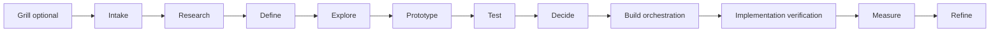

# Design Manager implementation plan

Joe-approved direction, 2026-10-01. TASK AE revises the plan after slice 1
(PR 15) merged. This change builds only necessary slice-1 contracts and tests.
All later slices below are planned, not implemented by this PR.

## Purpose and ownership

The Design Manager is Joe's first app powered by Codex and **app-agnostic
factory infrastructure** for designing all his future apps. It has its own
progress view and per-project design journal inside the factory. It never
lives in, reads from, or writes to DoctorCRE or the CARR record layer.
DoctorCRE is one future project, tested in the final slice after sample apps
qualify the manager.

A product-owned runner reads its repository, detects platforms, drives its app
and supplies permitted development artifacts through a generic receipt interface.
The manager has no product repository mount, product credential, production data
access or deployment authority. Product configuration and verification skills
remain product-owned. Products build, test and operate without the factory.
DoctorCRE's final run uses that same interface; no DoctorCRE adapter, CARR lookup,
direct product write or product runtime dependency is introduced.

## Verified platform facts and runtime choice

Official raw announcement and documentation pages were read on 2026-10-01.
**Verified** means the source documents the capability; account access and this
manager's integration require separate live qualification. **Unverified** marks
a claim not established by documentation or an end-to-end test.

| Capability | Launched / documented behavior | Subscription versus API billing | Status and source |
| --- | --- | --- | --- |
| Codex cloud environments | Reusable environments; tasks continue while the computer sleeps | Plus, Pro, Business, Healthcare, Education, Enterprise; plan allowance applies | Verified: [recap](https://openai.com/index/devday-2026-recap/), [cloud tasks](https://developers.openai.com/codex/cloud), [environments](https://learn.chatgpt.com/docs/environments/cloud-environments) |
| Codex SDK / app server | TypeScript `@openai/codex-sdk` starts/resumes local threads; Python `openai-codex` controls local app-server JSON-RPC with a pinned runtime; custom client integration | Local Codex supports ChatGPT subscription login on eligible plans; API-key execution is separately billed. SDK integration does not establish general subscription app hosting | Verified: [SDK](https://developers.openai.com/codex/sdk), [authentication](https://developers.openai.com/codex/auth), [app server](https://learn.chatgpt.com/docs/app-server), [pricing](https://developers.openai.com/codex/pricing). SDK submission of subscription cloud tasks: unverified |
| Plugins / extensions | ChatGPT and Codex share packaging/directory; sidebar apps, panels, file viewers and forms | Announced for all plans; extension docs say Free/Go web is coming soon and composer mentions are desktop-only | Verified: [packaging](https://developers.openai.com/plugins/build/plugins), [extensions](https://developers.openai.com/plugins/build/extensions), [recap](https://openai.com/index/devday-2026-recap/). Every extension on every Codex surface: unverified |
| Code review | Desktop diff review; automatic cloud first passes on GitHub/GitLab | Recap: all plans. Pricing explicitly includes cloud integrations in Plus; Free/Go rollout needs account verification | Verified: [recap](https://openai.com/index/devday-2026-recap/), [plan details](https://developers.openai.com/codex/pricing). Review does not itself pass a factory gate |
| Security scans | Codex Security Cloud scans GitHub repos, investigates/deduplicates findings and prepares fixes with laptop closed | Pro, Business, Enterprise, Edu; included Daybreak Blue models, no separate API key for this subscription surface | Verified: [recap](https://openai.com/index/devday-2026-recap/). Joe's enabled access and Security SDK entitlement: unverified |
| Agents API / app runtime | Managed Codex harness: sessions, recovery, MCP/tools and hosted sandboxes; computer use added | Related capabilities in Codex/Work: Pro 500, Enterprise. Direct API calls use model/tool/container API rates | Verified: [recap](https://openai.com/index/devday-2026-recap/), [platform overview/pricing](https://platform.openai.com/docs/guides/agents-api). Arbitrary manager hosting under Joe's existing plan: unverified |
| Dot research | Joe's default research seat, subject to availability | Pro / Business Premium in eligible markets; Enterprise/Edu/Healthcare beta needs admin enablement | Verified: [recap](https://openai.com/index/devday-2026-recap/). Programmatic Dot dispatch from this app: unverified |

**Runtime decision:** station runs execute primarily as Codex cloud tasks under
Joe's existing ChatGPT subscription in a published factory-only environment,
continuing without a Mac on. Slice 3 proves task creation, resume, cancellation,
timeout, subscription usage and laptop-off continuation on Joe's account. Use the
documented cloud surface first; local SDK threads must not be called cloud tasks.
No silent API-billing fallback or scheduled cloud routine is permitted.

Tasks are finite background processes. Completion requires checked artifacts and
a journal receipt. The MCP core/journal needs a persistent factory-controlled host
independent of the Mac; disposable cloud workspaces cannot be the canonical store.
Hosting cost/access and programmatic cloud submission remain open qualifications.
If the core is unavailable, retain a bounded result for idempotent import, mark
blocked and never fabricate a completed gate.

Claude remains the judgment seat through its subscription in headless background
mode. No paid Claude API key, Claude Code app session, scheduled task or Claude
cloud routine is used. Headless still requires a running host: Codex laptop-off
execution does not prove Claude laptop-off execution. Slice 3 qualifies an allowed
noninteractive subscription route on a persistent host, including expiry/limits.
Until qualified, dependent judgment gates are blocked; no author self-approval,
paid fallback or claim that every station already runs unattended.

## One core, thin adapters, own store

One core owns contracts, gates and journal commands and exposes **one MCP server**.
Thin Codex and Claude Code plugin adapters translate entry points and display
results; they cannot duplicate gates, maintain separate journals or grant authority.

```text
Factory progress view / Codex plugin / Claude Code plugin
                          |
                   Design Manager MCP core
                contracts + gates + journal
                          |
         factory SQLite database + immutable artifact files
                          |
               supplied product-runner receipts
```

**Codex plugin finding (verified):** the portable layout is root `plugin.json`,
schema `https://agent-plugins.org/schemas/1.0.0/plugin.schema.json`, `skills/`
and `mcp.json` with explicit transport types. OpenAI-specific presentation lives
under `extensions.com.openai`. `.codex-plugin/plugin.json` remains supported;
the current creator scaffolds that compatibility format. Choose the portable
format for the thin adapter. Local marketplace availability varies by surface.
Source: [official packaging guide](https://developers.openai.com/plugins/build/plugins).
MCP plus AGENTS.md/skills is a direct invocation path on a surface without
qualified plugin loading. The Claude Code plugin exposes the same core and
skills; it does not launch app sessions or own an orchestrator. Adapters wait
for slice 7. Optional extensions display the same progress projection, only
after surface qualification; they never become a runtime prerequisite.

**Store decision:** a small embedded SQLite database under the factory's private
state root, partitioned by user/project/version, plus immutable artifact files.
Proposed root: `~/.local/share/software-factory/design-manager/` on the persistent
factory host, containing `journal.sqlite` and `artifacts/`; this is private factory
state outside the source checkout. The same layout serves every app project.
Events, decisions, gates, evidence, worker receipts and provenance are structured
records, never Markdown journals. Transactions, uniqueness constraints, migrations
and indexed progress queries handle concurrent tasks and gate/event atomicity.
Files hold larger screenshots/repros; database refs and SHA-256 digests bind their
bytes. No database, credential or project research is committed to this public repo.

One persistent host owns the database writer, access control, backup and restore
checks. Cloud workers call MCP rather than share SQLite over a network filesystem.
Appends use idempotency keys and expected project revision; conflicts require a
reread. Evidence is archived before cleanup and its digest checked afterward.
Retention and artifact access are explicit per project; no standing product
secret is stored. SQLite beats loose canonical files for atomic updates and
deduplication; a server database waits for measured single-host limits. Nothing
uses CARR storage, CARR Model Room or its record API.

## Five stations and configurable workers

The five stations replace the 14-role relay. Roles become station checklists,
retaining every input/output rubric and stop below. One bounded assignment can
cover several applicable checklists. The manager records omissions and reasons
and enforces tier/gate requirements. `HandoffManifest.role` records checklist
provenance; it is not a hard-coded worker dispatch table.

Workers, model/effort, concurrency, availability and allowed routes come from a
private **per-user settings file**, proposed path
`~/.config/software-factory/design-manager/settings.json`. No credentials are
embedded. Intake binds the resolved profile's version/digest to a run. New settings
affect new assignments without rewriting receipts. Schema-check the file; an
unknown or missing route blocks instead of silently choosing a provider. Joe's
defaults below are editable settings, never constants in station implementation.

| Station | Joe's default allocation | Completion artifact |
| --- | --- | --- |
| Research | Dot (ChatGPT); Grok for X research | Primary sources, patterns, gaps and factual limits |
| Define | Codex structures intake/jobs/flows; Claude subscription judges material choices | Bounded problem/workflow/version contract and next interview question |
| Design | Codex builds concepts/prototypes/contracts; Claude judges choices | Compared alternatives, states, tokens, behavior and acceptance criteria |
| Prove | Fresh Codex worker drives VERIFY/e2e; independent Claude judges evidence | Exact-revision proofs, repros, gate verdict and limits |
| Ship | Codex packages accepted work; fresh reviewer proves changes live; Claude judgment | Independent verdict, closure contract and consumer receipts |

Fast / Thorough / Specialist / Best Available / Efficient-Eco remain modes within
eligible user settings. They cannot weaken rubrics, add a provider or authorize
extra spend. Qualification records the actual model/effort, account route, outcome,
latency and outage behavior. Existing factory workflows remain separate.

The optional up-front **grill uses an interview box with exactly one question at
a time**. Persist each answer before choosing the next. Never batch questions
or confirmations. Resume at the pending question and distinguish unknown from
declined. Tier chips explain the recommendation without becoming a batch interview.

## Contracts first

The existing public import remains `software-factory` (`src/index.mjs`). The typed
contract import is `software-factory/design-manager`. Slice 1 supplies
`src/design-manager.mjs`, its adjacent `design-manager.d.mts` declaration, and
`schemas/design-project.schema.json`. These describe development-time work;
they confer no execution, production, deployment or acceptance authority.

```ts
type DesignStage = 'grill' | 'intake' | 'research' | 'define' | 'explore'
  | 'prototype' | 'test' | 'decide' | 'build-orchestration'
  | 'implementation-verification' | 'measure' | 'refine';
type DesignTier = 'lean' | 'standard' | 'high-assurance';
type WorkStatus = 'active' | 'awaiting-human' | 'blocked' | 'closed';
type GateStatus = 'pending' | 'pass' | 'fail' | 'blocked';
type DesignStation = 'research' | 'define' | 'design' | 'prove' | 'ship';
type ProjectPlatform = 'web' | 'ios' | 'android' | 'desktop';
type ModelMode = 'fast' | 'thorough' | 'specialist' | 'best-available' | 'efficient-eco';
type EvidenceStrength = 'target-user-observation' | 'representative-user-testing'
  | 'domain-expert-feedback' | 'owner-task-testing' | 'heuristic-accessibility'
  | 'competitor-pattern-research' | 'simulated-critique';
interface ArtifactRef { ref: string; digest: string } // sha256 of artifact bytes
interface PersistenceProof {
  writtenValue: ArtifactRef; independentReadback: ArtifactRef; readbackMethod: string;
}
interface VerificationProof {
  sourceRevision: string; platform: ProjectPlatform; method: 'verify-skill' | 'e2e';
  entryPoint: string; entryPointStatus: 'exercised' | 'skipped' | 'blocked';
  outcome: 'passed' | 'failed' | 'blocked';
  actionAndResult: ArtifactRef; persistence: PersistenceProof | null;
}
interface EvidenceRef extends ArtifactRef {
  strength: EvidenceStrength; verification?: VerificationProof;
}
interface RoleContract {
  role: DesignRole; inputs: readonly string[]; outputs: readonly string[];
  rubric: string; stop: string;
}
interface HandoffManifest {
  role: DesignRole; makerId: string; artifact: ArtifactRef;
  evidence: EvidenceRef[]; unresolvedQuestions: string[];
  confidence: number; limits: string[];
}
interface GateRecord {
  gate: DesignGate; status: GateStatus; artifact: ArtifactRef;
  reviewerId: string; evidence: EvidenceRef[];
}
interface VersionContract {
  version: number; includedWorkflows: string[]; exclusions: string[];
  knownLimitations: string[]; blockingDefects: string[];
  acceptanceCriteria: string[]; deferredRefinements: string[];
  evidenceWindow: string;
}
interface DesignProject {
  schema: 'design-project.v1'; projectId: string; sourceRevision: string;
  platforms: ProjectPlatform[]; // nonempty, unique, declared at intake
  entry: DesignEntry; tier: DesignTier; stage: DesignStage; status: WorkStatus;
  versionContract: VersionContract; handoffs: HandoffManifest[]; gates: GateRecord[];
}
function nextDesignStage(stage: DesignStage): DesignStage | null;
function advanceDesignStage(stage: DesignStage, target: DesignStage): DesignStage;
function stationForDesignStage(stage: DesignStage): DesignStation;
function stationForDesignGate(gate: DesignGate): DesignStation;
// inspectProjectPlatforms takes supplied signals; evaluateMobileVerification
// returns a pure precondition; isVerifiedUserPath tests reported eligibility.
// Planned, not executable in slice 1:
// initialize(entry: DesignEntry, brief: Brief): Promise<DesignProject>
// route(station: DesignStation, state: DesignProject, settings: UserSettings): Promise<Assignment>
// review(handoff: HandoffManifest, candidate: ArtifactRef): Promise<GateRecord>
// appendJournal(project: DesignProject, event: JournalEvent): Promise<JournalRef>
// projectControlSurface(state: DesignProject, journal: JournalRef): ControlSurface
```

### Station checklists: inputs, outputs, rubrics and stops

Station workers consume structured project state and return the handoff above.
Every assignment stops on missing required input, unsupported authority, or an
unresolved consequential risk. Role-specific contract catalogs live in code;
this table is the implementation specification, not a durable project journal.

| Station checklist | Role | Inputs | Outputs | Pass criterion / stop condition |
| --- | --- | --- | --- | --- |
| Define (coordination across stations) | Design Manager | state, tier, scope, evidence, version contract | routing, assignments, progress rail, gate decisions, escalations, continuity | Every stage has owner, artifact, evidence standard and next state; stop hidden scope expansion |
| Research | Research Specialist | problem, domain, users, factual questions | primary sources, pattern inventory, evidence quality, gaps | Source facts and label inference; stop unsupported factual claims |
| Define | Product/UX Strategist | intent, research, business constraints | groups, jobs, outcomes, hypotheses, exclusions, measures | Observable outcomes; stop unbounded feature scope |
| Define | Workflow Architect | job, records, failure history, constraints | current/proposed flows, states, ownership, exceptions | Normal, refusal, recovery, handoff, concurrency; stop missing critical paths |
| Design | Information Architect | jobs, content, terms, retrieval needs | navigation, hierarchy, labels, findability, cross-surface model | Predictable homes and operating language; stop ambiguous authority/home |
| Design | Interaction Designer | accepted flow, authority, platforms | controls, forms, transitions, disclosure, feedback, recovery | Consequence/state/authority visible; stop dangerous ambiguity |
| Design | Prototype Specialist | concepts, devices, test questions | cheapest behaviorally adequate prototype | Answers declared questions; stop production claims |
| Design | Visual-System Designer | brand, components, accessibility, platforms | type, color, spacing, components, tokens, themes, hierarchy | Consistent, distinctive, readable, reusable; stop unjustified generic styling |
| Prove | Accessibility Specialist | flows, prototypes, components, candidate | criteria, manual checks, assistive tests, defects, remediation | Evidence for declared target; stop uncovered critical workflow/state |
| Prove | Usability/Evaluation Specialist | hypotheses, candidate, participants, limits | task scripts, observation protocol, metrics, severity, limits | Measures outcomes without coaching; stop simulated evidence labeled as users |
| Prove | Adversarial Reviewer | artifact, criteria, evidence, risks | assumptions, contradictions, failures, near misses, repairs | Objections answered or explicitly accepted; stop unaddressed consequential risk |
| Ship | Implementation Translator | accepted design, states, tokens, decisions | engineering contract, mappings, tests, references | Bounded implementation choices; stop uncheckable acceptance |
| Prove | Implementation Verifier | approved contract, exact candidate | behavior/visual/accessibility/state comparison | Separate source completion, deployment, activation and consumer proof; stop candidate mismatch |
| Prove | Measurement Specialist | released version, events, baseline, feedback, outcomes | deltas, regressions, ranked opportunities, next cycle | Baseline/window/population/limits; stop vanity or unsupported claims |

### Lifecycle, tiers, gates and authority



Initialization may begin at Intake when Grill is omitted. Within a version,
advancement follows adjacent stages. Refine has no automatic successor: a new
bounded version needs a new version contract. Stage advancement is bookkeeping,
not a gate pass. `status` describes work separately from stage; closure does not
mean deployment or successful acceptance. Future entry playbooks may select a
bounded subset with explicit criteria; this slice supplies only the standard path.

| Tier | Required work |
| --- | --- |
| Lean | concise grill, workflow, one/two concepts, owner testing, accessibility, implementation criteria, post-build review |
| Standard | Lean plus domain research, alternatives, interactive prototype, task evaluation, failure states, measurable baseline, decision record |
| High-Assurance | Standard plus representative users, privacy/threat analysis, formal accessibility, stronger validation, staged release, monitoring, rollback, independent assurance |

A workflow can require stronger assurance than its project. Unknown tier needs
an explicit upward recommendation, never an implicit Lean default. Human tier
selection uses chips showing recommendation, included/omitted evidence, effort
and protected risks. Evidence strengths are ordered as declared above; simulated
critique remains the weakest and must never become a user observation.

| Owning station | Gate | Comparison required |
| --- | --- | --- |
| Define | Problem | intent against observable problem/outcome |
| Define | Workflow | mapped job against owners, states, failures and exceptions |
| Design | Concept | chosen direction against credible alternatives and stated reasons |
| Prove | Interaction | critical task observations against completion criteria |
| Design | System | tokens/components and accessibility evidence against declared system/target |
| Ship | Build readiness | design against user/job, critical flow, tested risk assumptions, concept rationale, loading/empty/stale/failure/conflict/permission states, accessibility, checkable acceptance and post-build evaluation |
| Prove | Implementation fidelity | exact built candidate against accepted design contract |
| Prove | Operational evidence | real task outcomes against named baseline/window/population |
| Ship | Version closure | fixed included scope against acceptance, defects, exclusions, limitations, deferred work and V2 evidence window |

A GateRecord is a reported result, not authenticated certification. Later review
execution must establish maker/reviewer independence and exact artifact binding.
Ordinary repair is bounded to two failed rounds, then manager diagnosis and a
concise human choice. Manager controls sequence, tools, research and routine
repair. Human controls objectives, material tradeoffs, expansion, consequential
exceptions, activation and final acceptance. Challenge ordinary overrides once,
record, then proceed; significant privacy/security/accessibility/data-integrity/
legal/irreversible risks retain stronger confirmation or refusal. Only trust,
safety, data-loss or core-workflow failures reopen closed scope; other findings
enter the next ranked version. No automatic closed-version reopening in slice 1.

Stages remain the original path; station ownership groups work rather than
flattening the lifecycle into a new five-stage sequence:

| Station | Stages owned |
| --- | --- |
| Research | research |
| Define | grill, intake, define, refine |
| Design | explore, prototype, decide |
| Prove | test, implementation-verification, measure |
| Ship | build-orchestration; build-readiness and version-closure gates |

The interaction gate includes the mobile precondition below. An e2e outcome
`passed`, `failed` or `blocked` maps to a reported GateRecord `pass`, `fail` or
`blocked`; `pending` means no completed evaluation. Missing capability is the
specified deterministic `fail`, not a successful skipped check. None of these
reported records authenticates a reviewer or supplies user evidence by itself.

## Prove: VERIFY skill, feature map and proof rules (slice 4)

Each product owns a **VERIFY SKILL** and feature map, adapting pstack's pattern
to the product's supported skill directory rather than importing its Cursor
router. There is an index and one file per user-facing feature. Each feature
names its entry points, sub-features, user route, driving handles, observable
end state and gotchas. A convenient entry point cannot stand for all listed
entry points. Source: [pstack verification generator at the studied revision](https://github.com/cursor/plugins/blob/c47b12849e43f18d5c374c7069c744cc55b0ea00/pstack/skills/create-verification-skill/SKILL.md).

All five steps are required, in order:

1. **Launch:** use the product's documented command with isolated test data, ports and an owned process.
2. **Doctor:** check readiness, exact revision, process/port ownership and auth before driving; repeat after a failure.
3. **Drive:** exercise the user entry point with stable selectors/commands and declared task goals.
4. **Evidence:** capture action and result, side effects, exact revision and a second independent stored-value read.
5. **Cleanup:** tear down only resources created by this run; retain evidence outside scratch/output directories.

`EvidenceRef.verification` carries the proof receipt; it is optional for research
evidence, required whenever a path is claimed verified. It includes source
revision, platform/method, entry point/status, evaluation outcome, action/result
artifact and persistence proof. Stored writes require `writtenValue`, a distinct
`independentReadback` artifact and `readbackMethod`: for example, save via UI then
read through the product's existing read-only persistence interface. Two copies
of one screenshot are not independent reads. `persistence: null` is allowed only
for a path with no stored-value claim. Prove checks that claim against the feature
map and observed effects; callers cannot omit persistence to avoid the rule.

Proof rules retained from the stack study: use the real user path, re-read stored
values a second way, and **never count a skipped entry point as verified**. Internal
setters/test-only endpoints, final-screen-only captures, stale revisions, missing
readback, failed/blocked outcomes and skipped entry points fail eligibility.
Mocks are allowed only at an existing production boundary; observe what test mode
skips rather than trust its name. Digest fields bind bytes, not truth: Prove must
fetch/read artifacts and verify outcomes, independence and source binding live.

Slice 4 runs Launch through Cleanup once on a small sample app, confirms evidence
survives teardown, then deliberately breaks a mapped feature and confirms failure.
It also exercises skipped paths and forged/stale receipts. The slice-1 pure helper
checks reported eligibility only; it does not drive a browser or certify proof.

## Prove: agentic UI evaluation (slice 4, reused in 9–10)

Plan `capabilities/agentic-ui-evaluation/` as a factory wrapper around
[TesterArmy e2e](https://github.com/tester-army/e2e). Studied source revision:
`8d38206f460415b70706b45acb820bb0e24832ae`; package pin **`e2e@0.15.1`**, Apache-2.0.
Preserve license/provenance; exact companion dependencies are locked during
qualification. No package is installed or capability built by TASK AE.
Set **`E2E_TELEMETRY_DISABLED=1`** on every invocation, including explore, bug bash,
MCP and replay. Sources: [package/version](https://github.com/tester-army/e2e/blob/8d38206f460415b70706b45acb820bb0e24832ae/packages/e2e/package.json),
[license](https://github.com/tester-army/e2e/blob/8d38206f460415b70706b45acb820bb0e24832ae/LICENSE),
[telemetry switch](https://github.com/tester-army/e2e/blob/8d38206f460415b70706b45acb820bb0e24832ae/README.md).

The product owns e2e as a development dependency, its lockfile, `e2e.config.ts`,
fixtures, scripts and baseline expectations. The factory consumes supplied reports
and repro artifacts, normalizes outcomes and emits evidence/gate records. All e2e
agent critique is labelled **simulated critique**, never target-user observation
or representative-user evidence. `passed`, `failed` and `blocked` are distinct:
auth/startup/tool failure is blocked, a disproved expectation is failed, and a
passed run proves only the named exercised assertions on the named revision.
Accessibility remains **heuristic only**. Formal accessibility, assistive testing
and user outcomes still require their declared evidence; e2e cannot certify WCAG.

### Execution and attended authentication

Agent steps run through the **Codex worker using e2e's supported ChatGPT OAuth
provider** (`e2e/oauth/chatgpt`), on Joe's ChatGPT subscription, never Claude.
This is the chosen supported login route, not a Claude custom executor. Upstream
documents ChatGPT Plus/Pro support and explicitly no Claude subscription support.
The exact model comes from account-discovered available IDs and per-user settings.
Source: [subscription setup](https://github.com/tester-army/e2e/blob/8d38206f460415b70706b45acb820bb0e24832ae/docs/subscriptions.mdx).
Upstream support is verified from source; this wrapper's live login and OpenAI
eligibility for this third-party use remain unverified until slice 4. Do not infer
universal third-party billing entitlement from [Sign in with ChatGPT's participating-tool announcement](https://openai.com/index/devday-2026-recap/).

Browser/device OAuth is interactive and stored at `~/.config/e2e/oauth.json`
(or XDG config), outside every public repository. Restrict access to the user;
never copy tokens to Git, cloud task artifacts, logs or PRs. **Model-backed e2e
runs are attended only**, with Joe available for login. This is an explicit
exception to otherwise background Codex tasks: unattended tasks wait at a
blocked attended-evaluation checkpoint instead of hanging for auth or paying an
API fallback. Do not upload the Mac's OAuth file to a cloud environment.

The factory progress view tracks credential expiry/health without token contents.
Before expiry it marks affected evaluations blocked and displays one login action;
`LOGIN_REQUIRED`, missing expiry or a failed refresh health check also blocks
immediately. A watched first run proves the alarm and recovery. Persist the alarm
in the factory journal, never depend on a Mac timer or Claude scheduled task.
Successful automatic refresh does not make interactive recovery unattended-safe.
The unattended laptop-off milestone excludes model-backed e2e and unqualified
Claude/Dot routes; blocked dependencies must be visible and resumable.

The [GitHub PR-comment reporter](https://github.com/tester-army/e2e/blob/8d38206f460415b70706b45acb820bb0e24832ae/packages/github/README.md)
stays **off unless explicitly enabled per repository** with authorized publication
and permissions. Archive sanitized evidence before e2e's output directory is
replaced by another run. Sample fixtures contain no client/production data;
screenshots, traces and video need explicit access/retention controls.

### Explore, bug bash, MCP and acceptance

Use [explore](https://github.com/tester-army/e2e/blob/8d38206f460415b70706b45acb820bb0e24832ae/docs/explore.mdx)
for focused journeys, [bug bash](https://github.com/tester-army/e2e/blob/8d38206f460415b70706b45acb820bb0e24832ae/docs/bug-bash.mdx)
for bounded adversarial charters, and [MCP](https://github.com/tester-army/e2e/blob/8d38206f460415b70706b45acb820bb0e24832ae/docs/reference/mcp.mdx)
for open/drive/assert/close session steps. A finding counts **only when its repro
test fails with an assertion on the exact candidate**. A story, screenshot or
navigation/auth crash is not a confirmed bug. Reject an explained non-bug with
the expectation and observation; preserve discarded candidates for audit without
counting them as defects. Isolate concurrent charters' mutable state.

Qualification uses a small app with a frozen defect manifest and false-positive
traps, including intended refusal, empty/lazy state, permission denial and a
new-tab journey. Pass only if **every planted defect is caught with a failing
repro and no trap is flagged**. Missing coverage is failure, not a percentage pass.
Verify the planted bug is returned with its failing repro and an explained non-bug
is rejected. Repair the fixture separately, then show the same repro passes.
Compare run receipts to both broken and clean baselines.

The second run replays the recorded actions with **zero model calls**; count
provider invocations, not cached-step labels. Use deterministic assertions for
this replay: model-judged assertions/extraction are not evidence of zero-call
replay. Exploration is not assumed wholly cached. Sources: [executors/cache rules](https://github.com/tester-army/e2e/blob/8d38206f460415b70706b45acb820bb0e24832ae/docs/executors.mdx).
Replay the exact bound repro/test, assert the same outcome, archive evidence and
then clean up. Failure to detect a planted defect, a flagged trap, missing repro,
lost evidence or a nonzero replay model count disqualifies the wrapper. Keep it
a non-blocking pilot until these checks, version compatibility, runtime and an
escape/removal path pass; product-local deterministic checks remain authoritative.

## Deterministic mobile trigger

At intake `DesignProject.platforms` is required, nonempty and unique, with values
`web`, `ios`, `android`, `desktop`. The product-owned detector reads package
dependencies (`react-native`, `expo`), `ios/` / `android/` folders and `app.json`.
It supplies normalized signals to `inspectProjectPlatforms`; the factory itself
does not read a product repository. React Native/Expo or unqualified `app.json`
conservatively suggests both mobile platforms; explicit app.json platforms and
native folders add detected platforms. Detected platforms absent from intake
produce a mismatch and stop advancement until the declaration is reconciled.
Declared desktop/web platforms are not removed merely because native detection
cannot establish them. Ambiguous platform signals require an explicit resolution.

If platforms include iOS or Android, Prove requires, for **each** declared mobile
platform, simulator/emulator execution of the VERIFY skill **and e2e's mobile
engine**, with exact-revision user-path evidence. The interaction and implementation
fidelity gates cannot pass without these proofs. Until the capability exists,
the gate **fails** with exactly:

```text
mobile verification capability not installed: add capabilities/mobile-verification (e2e mobile engine / agent-device, stim, argent; see docs/design-manager/parked.md)
```

`evaluateMobileVerification` centralizes this pure contract precondition. A passed
precondition only reports supplied proof coverage; the future gate must verify
the installed qualified capability, simulator identity, mobile engine, artifact
bytes and every feature entry point. Missing evidence remains pending; blocked
evaluation stays blocked at the gate. Never treat an empty directory or supplied
capability name as installation proof. The iOS-without-capability test checks the
exact failure message now; skipped/stale proofs and missing methods also cannot
pass. The trigger and each parked tool are in [parked.md](parked.md). Upstream
mobile uses agent-device with iOS simulators/Android emulators; iOS requires
appropriate simulator hosting. Source: [e2e mobile docs](https://github.com/tester-army/e2e/blob/8d38206f460415b70706b45acb820bb0e24832ae/docs/mobile.mdx).

## Ship independent verdict

Ship requires an **independent verdict before landing**: a fresh agent receives
the accepted contract, exact built revision and live target, independently proves
each change and reads the evidence. Reviewer is never the author; identity and
fresh context are checked, not merely asserted in a manifest. All known fixes
go in **one push**, followed by fresh exact-revision checks/verdict; new findings
invalidate only the affected proof and restart bounded repair. Source:
[pstack verify-and-ship](https://github.com/cursor/plugins/blob/c47b12849e43f18d5c374c7069c744cc55b0ea00/pstack/docs/guide/06-verify-and-ship.md).
Ship recommends readiness, never grants merge/deployment authority. For TASK AE,
one ordinary PR is delivered with green CI; this session never merges it.

## Prove maintenance (slices 9–10)

Slices 9–10 run a VERIFY-skill maintenance pass before task evidence. Outcomes are
**clean / changed / blocked**. It may edit only verification skills, helper scripts
and the feature map; **never product code**. Run Doctor and compare current routes,
selectors and entry points with the map. If the app works through its current
user route but the map is outdated, update the map and report changed. If the
mapped intended behavior fails in the running app, report a product defect with
failing repro; do not repair it inside maintenance. Missing auth/build/host or
unresolved intent yields blocked, not a speculative map edit. Re-run corrected
verification instructions and preserve evidence through cleanup. Source:
[pstack maintenance](https://github.com/cursor/plugins/blob/c47b12849e43f18d5c374c7069c744cc55b0ea00/pstack/skills/maintain-verification-skill/SKILL.md).

## Own progress view and tool contracts

The factory view projects station/stage/gate, tier/included evidence, current
worker/model/effort, artifact, pending interview decision, scope/exclusions,
evidence strength, tests, review/repair, blocked reason, deferred improvements and
next cycle from its own journal. Default view shows one artifact, immediate
decision and recommendation; detail stays collapsed. It needs a progress visual,
dark cinematic treatment, keyboard/focus/reflow/contrast/target sizing,
screen-reader semantics, reduced motion and error/recovery evidence, with WCAG
2.2 AA as the declared target. Heuristic e2e is not compliance certification.

FigJam serves flows/synthesis; Figma serves native editable canvases/systems;
HTML/browser prototypes serve behavior and realistic states. Production work
starts after build readiness. Existing implemented truth reaches the manager
through product-supplied artifacts; Figma changes design intent only through an
accepted version. Claude Design remains an explicit optional human-visible
handoff in the penultimate tool slice. No app-session automation is introduced.
Access/login, extra cost, publication, destructive replacement and material
direction changes retain their human boundary.

## Ordered slices and verification

Each slice must pass on small sample apps before proceeding. Use a synthetic web
task app and an unrelated catalog app; include mobile declaration fixtures from
slice 1 and simulator samples once the mobile trigger fires. No real product or
client data is needed. Slice 13 is the first full DoctorCRE run. Sequence brings
independent review/testing, prototypes and implementation proof ahead of Figma
and Claude Design. Slices 4, 9 and 10 retain their requested numbers.

| Slice | Deliverable | Artifact read / compared against | Failure condition |
| --- | --- | --- | --- |
| 1. Contracts (merged; AE extensions only) | lifecycle, tiers, checklist catalogs, handoffs/gates/version schema; stations, platforms, proof receipt and pure mobile precondition | actual public contract module/declarations/schema and sample fixtures against original catalogs, station/gate tables, malformed cases and baseline npm tests | renamed/lost rubric or stop, schema/type drift, invalid jumps, missing platforms, skipped/stale proof passes, iOS missing capability does not fail with exact message, regression |
| 2. Entry playbooks | new product, feature, workflow redesign, audit, post-build refinement and all existing entry paths; one-question grill | initialized states/interview trace on sample apps against required artifacts and tier criteria | omitted critical work, batch interview, silent Lean default, hidden scope expansion |
| 3. User settings and Codex cloud qualification | configurable station workers/modes; Joe profile; qualified background subscription runtime and dependent-seat routes | resolved settings, actual task IDs/model/effort/usage/resume/cancel/timeout results from a laptop-off sample task against source docs and eligible route baseline | hard-coded seat, API billing fallback, local execution called cloud, lost result, hidden blocked Claude/Dot route, unqualified entitlement or expiry recovery |
| 4. Independent review, VERIFY and agentic UI qualification | maker/reviewer/tester independence, bounded repair/escalation; product VERIFY/map; e2e explore/bug bash/MCP wrapper | frozen planted-defect/trap manifest, broken/clean app outputs, failing repros, independent reviewer context, archived proof after cleanup and second-run model-call count against all declared expectations | author approves self, any defect missed, any trap flagged, non-bug accepted, no failing repro, broken VERIFY passes, lost evidence, model call during replay, third failed automatic repair, missing escalation |
| 5. Factory Design Journal | SQLite records, immutable artifacts, MCP-ready commands, project isolation and restore | actual written/read-back/restore records and digest-addressed bytes against decisions, idempotency/revision conflicts, scope and evidence labels on sample apps | provenance loss, cross-project access, transcript dependence, conflicting authority, public/private material committed, incomplete restore |
| 6. Own progress view | lightweight browser supervision and one-question interview box | rendered/task-observed sample state against journal projection, comprehension and accessibility criteria | false station/gate/expiry status, unclear decision, missing progress visual, batch question, accessibility/trust failure, added cognitive load |
| 7. MCP core and thin plugin adapters | one contracts/gates/journal server; portable Codex package and Claude Code plugin | actual MCP request/response and install/invoke receipts on supported surfaces against same core command results and declared schema | duplicate gate/store, unqualified plugin loading, app session created, paid key, authentication leak, surface mismatch |
| 8. Design synthesis and build readiness | station checklist orchestration, alternatives, workflows/states/tokens, translator and acceptance contract | sample-app design artifacts against all retained rubric/stops, gate table and credible alternatives | omitted required checklist, unchecked system/flow, generic unjustified styling, uncheckable acceptance, scope drift |
| 9. Behavioral prototypes and usability scripts | coded task behavior; reuse qualified e2e; VERIFY maintenance; owner/representative task scripts per tier | live sample prototype, scripts/observations/screens and clean/changed/blocked maintenance results against declared questions, loading/empty/stale/failure/conflict/permission/recovery states and prior baseline | missing critical state, stale map confused with product bug, maintenance edits product code, production claim, coached discoverability, simulated critique labelled users |
| 10. Implementation verification | exact built-revision checks paired with e2e, independent live verdict, VERIFY maintenance and mobile requirement when applicable | accepted contract versus product-runner build SHA/artifact digest, exact deterministic check outputs, live repros/visual/state/accessibility comparisons and deployment/activation/consumer receipts | revision mismatch, stale passing check, heuristic accessibility claimed formal, missing simulator/mobile-engine evidence, self-verdict, unproven consumer behavior |
| 11. Figma pilot | native draft create/edit, FigJam, live-screen capture, components/variables/auto layout | editable native artifacts on sample apps against exact source screen/tokens and operation checklist | any required capability unproved, duplicate work without measured value, upgrade without proved plan blocker |
| 12. Claude Design handoff | optional visible human handoff, retaining source binding | actual artifact refs and acknowledgments on sample apps against declared task/subscription route | app automation, paid API, lost provenance, unapproved publication |
| 13. Full DoctorCRE design cycle | full lifecycle, exact candidate verification, measurement and bounded next version after manager qualification | product-owner supplied baseline/candidate receipts, task observations and measurement records against chosen real-work task set and accepted contract | no measured improvement, unresolved trust/safety/core failure, direct DoctorCRE/CARR access, product runtime dependency, nonreconstructible proof |

Slice 13 retains the prior final-run task set: priorities, condition/commitments/
next action, authoritative retrieval, commitment capture/assignment and one visual
automation. The product owner selects and runs tasks; the manager receives bounded
sanitized observations. Measure timing, completion, errors, retries, recovery,
explanation, reversals and confidence; protect commitments, ownership, provenance
and task completion. Capture metadata rather than sensitive bodies or indiscriminate
replay. Test-mode capture needs visible consent, purpose, access and retention.
Statistical A/B claims require randomization, power, trustworthy telemetry and
predeclared metrics. Weekly triage, then monthly triage/quarterly UX review remain
process requirements, not authorization for scheduled tasks in this PR.

## Scope, provenance and open questions

`createFactory().run(job, adapter)` and existing build/index capabilities stay
unchanged. Slice-1 contracts use the existing typed import and pinned Ajv schema
checks; no universal enforcement framework, dispatcher, journal, plugin, browser
runner or e2e package is built now. The new required platforms field is an early
contract revision within `design-project.v1`; no deployed journal migration or
existing stored consumer was found in this repository. Later persistence must
version migrations explicitly. Role catalog names remain checklist provenance.

This plan replaces the prior DoctorCRE-first placement and CARR source/store
assumptions under Joe's explicit TASK AE direction. Public source studies link
upstream instead of copying code. pstack is MIT, studied at
`c47b12849e43f18d5c374c7069c744cc55b0ea00` ([license](https://github.com/cursor/plugins/blob/c47b12849e43f18d5c374c7069c744cc55b0ea00/pstack/LICENSE)).
The [shared X post](https://x.com/stringsaeed/status/2105734077085303106) was not
read successfully (Grok retrieval timed out); no post text or inferred claim is
treated as verified. Applications above come from raw public pstack/e2e files and
Joe's specified additions. Parked mobile tools, MiniSim and pstack's full router
are declined for now with reasons and deterministic return conditions in
[parked.md](parked.md); they are not silently discarded.

Open questions, all **unverified** until the owning slice supplies a receipt:

| Question | Owner / settlement test |
| --- | --- |
| Which existing Joe plan and workspace expose cloud tasks, Dot and security scans? | Slice 3: actual account access and allowance readback; no upgrade assumed |
| Can the manager submit/steer subscription cloud tasks programmatically on the qualified surface? | Slice 3: supported submission/resume test; do not substitute paid Agents API |
| Where does the persistent factory MCP/SQLite host run, with backups, no Mac dependency and authorized cost? | Slices 3/5/7: host choice and restore/offline-Mac qualification before unattended claim |
| Is headless Claude subscription judgment allowed and operational on that host; how do expiry/limits recover? | Slice 3: watched login, noninteractive judgment and expiry alarm; dependent gate stays blocked |
| Can Dot/Grok research results reach the core without a CARR or product dependency? | Slice 3: qualified receipt/import route; no invented vendor automation |
| Does Joe's account support e2e ChatGPT OAuth use; can its attended worker return cloud-bound evidence safely? | Slice 4: login, exact account model, usage and expired-token tests; no OAuth upload or paid fallback |
| How is an independent reviewer identity/fresh context authenticated, beyond supplied strings? | Slice 4: author/reviewer collision and forged-receipt adversarial tests |
| Which iOS simulator host and exact mobile companion pins meet the triggered gate? | Triggered mobile qualification: simulator + mobile-engine fixture, license/version/runtime/removal checks |
| What additional claims or linked sources does the unread X post contain? | Research: retry through a qualified Grok route, read raw post/links; retain unverified status until then |

TASK AE ends with local/hosted CI green and one ordinary unmerged PR. Orchestrator
review with Jev occurs before any later merge. No later slice has been delivered
merely because its plan or reported receipt type exists.
