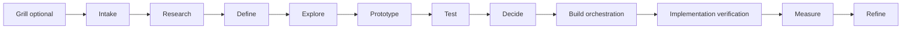

# Design Manager pilot implementation plan

## Contracts first

The existing public import remains `software-factory` (`src/index.mjs`). The typed
contract import is `software-factory/design-manager`. Slice 1 adds
`src/design-manager.mjs`, its adjacent `design-manager.d.mts` declaration, and
`schemas/design-project.schema.json`. These describe development-time work;
they confer no execution, production, deployment or acceptance authority.

```ts
type DesignStage = 'grill' | 'intake' | 'research' | 'define' | 'explore'
  | 'prototype' | 'test' | 'decide' | 'build-orchestration'
  | 'implementation-verification' | 'measure' | 'refine';
type DesignTier = 'lean' | 'standard' | 'high-assurance';
type WorkStatus = 'active' | 'awaiting-human' | 'blocked' | 'closed';
type GateStatus = 'pending' | 'pass' | 'fail';
type ModelMode = 'fast' | 'thorough' | 'specialist' | 'best-available' | 'efficient-eco';
type EvidenceStrength = 'target-user-observation' | 'representative-user-testing'
  | 'domain-expert-feedback' | 'owner-task-testing' | 'heuristic-accessibility'
  | 'competitor-pattern-research' | 'simulated-critique';
interface ArtifactRef { ref: string; digest: string } // sha256 of artifact bytes
interface EvidenceRef extends ArtifactRef { strength: EvidenceStrength }
interface RoleContract {
  role: DesignRole; inputs: readonly string[]; outputs: readonly string[];
  rubric: string; stop: string;
}
interface HandoffManifest {
  role: DesignRole; makerId: string; artifact: ArtifactRef;
  evidence: EvidenceRef[]; unresolvedQuestions: string[];
  confidence: number; limits: string[];
}
interface GateRecord {
  gate: DesignGate; status: GateStatus; artifact: ArtifactRef;
  reviewerId: string; evidence: EvidenceRef[];
}
interface VersionContract {
  version: number; includedWorkflows: string[]; exclusions: string[];
  knownLimitations: string[]; blockingDefects: string[];
  acceptanceCriteria: string[]; deferredRefinements: string[];
  evidenceWindow: string;
}
interface DesignProject {
  schema: 'design-project.v1'; projectId: string; sourceRevision: string;
  entry: DesignEntry; tier: DesignTier; stage: DesignStage; status: WorkStatus;
  versionContract: VersionContract; handoffs: HandoffManifest[]; gates: GateRecord[];
}
function nextDesignStage(stage: DesignStage): DesignStage | null;
function advanceDesignStage(stage: DesignStage, target: DesignStage): DesignStage;
// Planned, not executable in slice 1:
// initialize(entry: DesignEntry, brief: Brief): Promise<DesignProject>
// route(role: DesignRole, state: DesignProject, mode: ModelMode): Promise<Assignment>
// review(handoff: HandoffManifest, candidate: ArtifactRef): Promise<GateRecord>
// appendJournal(project: DesignProject, event: JournalEvent): Promise<JournalRef>
// projectControlSurface(state: DesignProject, journal: JournalRef): ControlSurface
```

### Roles, inputs, outputs, rubrics and stops

All specialists consume structured project state and return the handoff above.
Every assignment stops on missing required input, unsupported authority, or an
unresolved consequential risk. Role-specific contract catalogs live in code;
this table is the implementation specification, not a durable project journal.

| Role | Inputs | Outputs | Pass criterion / stop condition |
| --- | --- | --- | --- |
| Design Manager | state, tier, scope, evidence, version contract | routing, assignments, progress rail, gate decisions, escalations, continuity | Every stage has owner, artifact, evidence standard and next state; stop hidden scope expansion |
| Research Specialist | problem, domain, users, factual questions | primary sources, pattern inventory, evidence quality, gaps | Source facts and label inference; stop unsupported factual claims |
| Product/UX Strategist | intent, research, business constraints | groups, jobs, outcomes, hypotheses, exclusions, measures | Observable outcomes; stop unbounded feature scope |
| Workflow Architect | job, records, failure history, constraints | current/proposed flows, states, ownership, exceptions | Normal, refusal, recovery, handoff, concurrency; stop missing critical paths |
| Information Architect | jobs, content, terms, retrieval needs | navigation, hierarchy, labels, findability, cross-surface model | Predictable homes and operating language; stop ambiguous authority/home |
| Interaction Designer | accepted flow, authority, platforms | controls, forms, transitions, disclosure, feedback, recovery | Consequence/state/authority visible; stop dangerous ambiguity |
| Prototype Specialist | concepts, devices, test questions | cheapest behaviorally adequate prototype | Answers declared questions; stop production claims |
| Visual-System Designer | brand, components, accessibility, platforms | type, color, spacing, components, tokens, themes, hierarchy | Consistent, distinctive, readable, reusable; stop unjustified generic styling |
| Accessibility Specialist | flows, prototypes, components, candidate | criteria, manual checks, assistive tests, defects, remediation | Evidence for declared target; stop uncovered critical workflow/state |
| Usability/Evaluation Specialist | hypotheses, candidate, participants, limits | task scripts, observation protocol, metrics, severity, limits | Measures outcomes without coaching; stop simulated evidence labeled as users |
| Adversarial Reviewer | artifact, criteria, evidence, risks | assumptions, contradictions, failures, near misses, repairs | Objections answered or explicitly accepted; stop unaddressed consequential risk |
| Implementation Translator | accepted design, states, tokens, decisions | engineering contract, mappings, tests, references | Bounded implementation choices; stop uncheckable acceptance |
| Implementation Verifier | approved contract, exact candidate | behavior/visual/accessibility/state comparison | Separate source completion, deployment, activation and consumer proof; stop candidate mismatch |
| Measurement Specialist | released version, events, baseline, feedback, outcomes | deltas, regressions, ranked opportunities, next cycle | Baseline/window/population/limits; stop vanity or unsupported claims |

### Lifecycle, tiers, gates and authority



Initialization may begin at Intake when Grill is omitted. Within a version,
advancement follows adjacent stages. Refine has no automatic successor: a new
bounded version needs a new version contract. Stage advancement is bookkeeping,
not a gate pass. `status` describes work separately from stage; closure does not
mean deployment or successful acceptance. Future entry playbooks may select a
bounded subset with explicit criteria; this slice supplies only the standard path.

| Tier | Required work |
| --- | --- |
| Lean | concise grill, workflow, one/two concepts, owner testing, accessibility, implementation criteria, post-build review |
| Standard | Lean plus domain research, alternatives, interactive prototype, task evaluation, failure states, measurable baseline, decision record |
| High-Assurance | Standard plus representative users, privacy/threat analysis, formal accessibility, stronger validation, staged release, monitoring, rollback, independent assurance |

A workflow can require stronger assurance than its project. Unknown tier needs
an explicit upward recommendation, never an implicit Lean default. Human tier
selection uses chips showing recommendation, included/omitted evidence, effort
and protected risks. Evidence strengths are ordered as declared above; simulated
critique remains the weakest and must never become a user observation.

| Gate | Comparison required |
| --- | --- |
| Problem | intent against observable problem/outcome |
| Workflow | mapped job against owners, states, failures and exceptions |
| Concept | chosen direction against credible alternatives and stated reasons |
| Interaction | critical task observations against completion criteria |
| System | tokens/components and accessibility evidence against declared system/target |
| Build readiness | design against user/job, critical flow, tested risk assumptions, concept rationale, loading/empty/stale/failure/conflict/permission states, accessibility, checkable acceptance and post-build evaluation |
| Implementation fidelity | exact built candidate against accepted design contract |
| Operational evidence | real task outcomes against named baseline/window/population |
| Version closure | fixed included scope against acceptance, defects, exclusions, limitations, deferred work and V2 evidence window |

A GateRecord is a reported result, not authenticated certification. Later review
execution must establish maker/reviewer independence and exact artifact binding.
Ordinary repair is bounded to two failed rounds, then manager diagnosis and a
concise human choice. Manager controls sequence, tools, research and routine
repair. Human controls objectives, material tradeoffs, expansion, consequential
exceptions, activation and final acceptance. Challenge ordinary overrides once,
record, then proceed; significant privacy/security/accessibility/data-integrity/
legal/irreversible risks retain stronger confirmation or refusal. Only trust,
safety, data-loss or core-workflow failures reopen closed scope; other findings
enter the next ranked version. No automatic closed-version reopening in slice 1.

### Control surface and tool contracts (later slices)

`ControlSurface` projects stage/gate, tier/included evidence, active specialist/
model/effort, artifact, pending decisions, scope/exclusions, evidence/test results,
review/repair status, deferred improvements and next cycle. Default view shows
one artifact, immediate decision and recommendation. Detail stays collapsed.
The browser surface needs a progress visual, dark cinematic treatment, keyboard
operation, focus, reflow, contrast, target sizing, screen-reader semantics,
reduced motion, error and recovery evidence (WCAG 2.2 AA where applicable).

FigJam serves flows/synthesis; Figma serves native editable canvases and systems;
HTML/browser prototypes serve behavior and realistic states. Production code
starts after readiness. Existing code is initial implemented truth; Figma can
supersede design intent only through an accepted version. Claude Design remains
an explicit human-visible optional handoff. Claude model work uses subscription
access, never a paid API key. No Claude app sessions, scheduled tasks or cloud
routines are created by this pilot. Pause for access/login, cost, publication,
destructive replacement or material direction changes.

## Ordered slices and verification

The order follows the blueprint's minimal pilot scope. Only slice 1 is built by
TASK AC. Later signatures above are proposals, not dispatchable capabilities.

| Slice | Deliverable | Artifact read and comparison | Failure |
| --- | --- | --- | --- |
| 1. Contract model | lifecycle, tiers, roles, handoffs, gates, version schema; pure adjacent-stage helpers and declarations | import actual public module, compile schema with Ajv, compare catalogs to blueprint, validate DoctorCRE/unrelated fixtures and malformed cases; compare full npm test against unchanged baseline | missing/renamed contract, schema/type drift, unknown/extra fields accepted, invalid jumps, existing test regression |
| 2. Entry playbooks | new product, feature, workflow redesign, audit, post-build refinement; retain the other blueprint entry paths | read initialized states for each path against task/required artifact fixtures | omitted critical work, silent tier default, hidden scope expansion |
| 3. Model modes | qualified role-aware Fast/Thorough/Specialist/Best Available/Efficient/Eco | read route/evaluation receipts against eligible Model Room evidence and baseline | unqualified route, hardcoded model role, paid Claude key, missing/outage handling or Jev accounting |
| 4. Independent review and repair | maker/reviewer/tester profiles, bounded repair, escalation | read exact artifact review manifests against seeded defects and reviewer identity/context; count failed repairs | maker certifies self, seeded defect passes, third automatic failed round, missing escalation |
| 5. Design Journal | structured versioned records and project adapters | read records back against written decisions, artifact digests, scope and evidence labels | lost provenance, private CARR content in public repo, transcript dependence, duplicate authority |
| 6. Browser supervision | lightweight visual control surface | read rendered state and task observations against journal projection, novice comprehension and accessibility criteria | false stage/gate, unclear decision, missing visual, accessibility/trust failure, more cognitive load |
| 7. Figma pilot | draft create/edit, FigJam, live screen, components/variables/auto layout | read native draft/diagram/capture/component artifacts against exact source screen/tokens and operation checklist | any required capability unproved, duplicate work without value; no upgrade before proven plan block |
| 8. Claude Design handoff | optional visible human handoff | read artifact references/acknowledgments against declared task and subscription route | app automation, paid API, lost provenance, unapproved publication |
| 9. Behavioral prototypes | coded states, browser tasks/screenshots, accessibility evidence | inspect prototype behavior/screens against test questions and loading/empty/stale/failure/conflict/permission/recovery cases | production claims, coached discoverability, simulated users mislabeled, missing critical states |
| 10. DoctorCRE V2 cycle | complete lifecycle and exact-candidate verification/measurement | read released baseline and candidate receipts, observations and measurement records against selected real-work task set | no measured improvement, unresolved trust/safety/core failure, product runtime dependency, nonreconstructible evidence |

Slice 10 baselines include priorities, deal condition/commitments/next action,
authoritative retrieval, commitment capture/assignment, and one visual automation.
Record timing, completion, errors, retries, recovery, explanation, reversals and
confidence; protect commitments, ownership, provenance and daily-work completion.
Collect metadata rather than sensitive bodies or indiscriminate replay. Test-mode
capture needs visible consent, purpose, access and retention. Statistical A/B
claims require randomization, power, trustworthy telemetry and predeclared metrics.
V1 observation uses weekly triage, later monthly triage/quarterly UX review; these
are process requirements, not authorization to create scheduled tasks here.

## Existing seams, boundary and source binding

`createFactory().run(job, adapter)` stays unchanged. The future translator feeds
accepted contracts through existing pinned Git excerpts to attended Codex source
work, then uses independent exact-candidate verification. `routeDoctorCreBuild`
keeps deterministic qualification and baseline fallback; new design-role routing
must earn its own qualification rather than reuse build evidence as design proof.
Factory Jev calls use `askJev` and its existing accounting ledger. No credential
is added or stored. Schema validation is a development check using pinned Ajv;
it is not a new required product architecture adapter or runtime dependency.

This repository owns reusable code/contracts/fixtures and this implementation
plan. Products own implementation and project configuration. CARR records,
domain authority, runtime events and CARR decisions/evidence stay in carr-system.
No fourth repository, event broker or durable Markdown journal is introduced.
The pure contract reduces later coordination and adds no daily supervision duty.

Authority: Joe's TASK AC instruction on 2026-10-01 authorizes starting now and
limits delivery to an ordinary unmerged PR. It overrides the blueprint's earlier
wait-for-V5 implementation ordering for this slice; it does not prove V5 readiness.
Read source: `design-manager-operating-blueprint`, generation 1171, retrieved in
full from CARR doctrine on 2026-10-01 local time. Sections: operating doctrine @1,
specialist contracts @1, tool routing @1, DoctorCRE V5 guidance @2, V2 refinement
@1, software-factory pilot @1. Pilot section reference:
`287fe6fd-09cb-41ea-bc41-c73a53053664@1`, content hash
`1fdce98af1e19f92d72efbf26237e3064c175ac26d0090a129304ae750cf43f6`.
The document catalog and direct pilot-section read agree. This plan adapts the
approved requirements; it does not copy private research or become doctrine.

## Ambiguities and limits

The blueprint specifies semantic stages and gates, but not wire names, gate-to-
stage placement, entry-path skip rules, journal backend, or authentication of
reviewer identity. Hyphenated lowercase wire names, separate work status and
adjacent-only standard progression are slice-1 choices. Gate placement and
identity verification wait for slice 4; journal storage waits for slice 5.
Artifact refs carry digests but this slice does not fetch or authenticate them.
Type/schema validity does not prove design quality, usability, independence,
acceptance, release or activation. All blueprint sections were readable after
using the supported `document` field; the requested `slug` field was refused.
