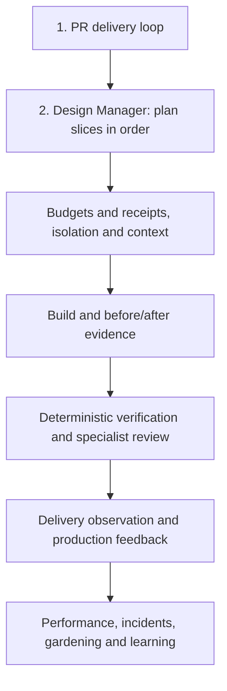

# Software factory finish line

As of **2026-10-02**, against source commit
`49ee8a35f84caafce5b95eddea5ffe0b69d29af4`, the factory is
**19.0% complete by capability count: 4 passing done tests / (19 scope rows +
2 added rows) × 100 = 19.0476%, rounded to one decimal**. The passing rows are
`design-contracts`, `authenticated-evaluation-bundle`, `qualified-model-routing`
and `risk-routing`. This measures finished capabilities, not lines of code,
elapsed effort or production readiness. A tested hook does not finish the
behavior it delegates. No partial credit enters the numerator.

**Remaining estimate: 88–149 working days**, summed from the remaining-work
ranges below. These are planning estimates for one primary implementer, including
fixtures, review, repair and delivery; completed rows have zero remaining days.
They exclude weekends, account/hosting approval waits, unavailable user-testing
participants and vendor outages. Parallel work can shorten elapsed time; this is
not a promised calendar date. Design Manager includes its planned sample-app,
triggered mobile and final product qualification work. Its contract slice is
already built and receives no second estimate. Reuse of future shared machinery
must reduce these estimates when proved; it is not assumed today.

The factory is done when **every row's done test passes on the exact candidate**,
with archived evidence and any required live qualification, while products still
build, test and operate without the factory. Delivery/deploy/rollback authority
stays with each product. This document is the acceptance specification; job,
evaluation, evidence and provenance records belong in private structured storage,
not in this Markdown file.

## How to get the same verdict

All checks below are required for a row to count as done:

1. Install the pinned dependencies with `npm ci` from the repository root.
2. Run the row's command against the stated fixture on the candidate revision.
3. Compare assertions and artifact contents with the row's expected result.
4. Require zero failures, zero skipped cases and every stated live receipt.

A command marked **planned** names the acceptance test to deliver with that
capability. Its file and fixture do not exist yet, so its verdict today is
**not done**, not a green result inferred from this specification. No future
test file is claimed to have run. The test must exercise the implementation
through its public interface, including the failing fixture; static presence,
invented receipts and mocked pass responses cannot qualify an executable adapter.
Live requirements use a product-owned sandbox or supplied sanitized receipts,
never product credentials or production data stored in this repository.

Classify a row in this order: does its entire done test pass today? If yes,
**built and tested**. Otherwise, does a checked-in contract, adapter or step exist?
If yes, **skeleton step only**, and name the partial implementation. Otherwise,
**not started**, citing the scope/plan that declares it. The added PR loop is not
started *in this repository*; Joe reports that untracked orchestrator scripts
already run it daily. That is usage evidence, not checked-in test evidence.

## Build sequence

Read top to bottom. PR delivery is first because the daily untested machinery is
the highest-risk gap, per Joe's priority. Design Manager follows its own ordered
plan. Completed prerequisites appear in the sequence for traceability and need
no rebuild. The remaining rows follow their prerequisites; the estimates cover
their residual factory-wide behavior beyond the Design Manager's own workflow.

| Order | Capability | What it is | Current state and proof file | Done test: command, fixture, expected result | Dependencies | Remaining working days |
| --- | --- | --- | --- | --- | --- | --- |
| 1 | `pr-delivery-loop` — PR delivery loop | It runs review, repair, CI repair, merge queue and usage limiting until a branch is delivered or stops with a reason. | **not started** in the tracked factory; [operating-loop.mjs](../src/operating-loop.mjs) provides bounded review/verify calls, not this daily loop; the untracked machinery is Joe-reported and unaudited here. | **Planned:** `node --test test/acceptance/pr-delivery-loop.test.mjs`; disposable Git repository and scripted GitHub/model responses covering review rejection, changing head, CI failure, queue conflict, rate/usage limit and restart after an ambiguous merge response; assert bounded repairs, exact-head checks, no main/force push, no duplicate merge or model spend, and a persisted terminal reason. Qualify once on a sandbox PR with hosted CI, independent orchestrator review and merged-head readback. | Existing operating-loop kernel; approved sandbox merge authority and runtime usage input, supplied per run. | 8–12 |
| 2 | `design-manager` — Design Manager | It guides an app from a bounded design problem through independently proved implementation and the next measured version. | **skeleton step only**; [design-manager.mjs](../src/design-manager.mjs) implements pure contracts and helpers; execution, journal and view remain planned in [its plan](design-manager/plan.md#ordered-slices-and-verification). | **Planned:** `node --test test/acceptance/design-manager.test.mjs`; the plan's synthetic task/catalog apps, mobile samples when triggered, and product-owner supplied DoctorCRE receipts; require every slice's comparison and failure condition in the linked plan to pass in its specified order. Read actual artifacts and account/runtime, independent-review, restore and consumer receipts; contract tests alone cannot pass this row. | PR delivery loop; built design-contracts; account/host qualification in its plan. Follow the plan rather than the legacy DoctorCRE-specific Model Room route. | 35–60 |
| 3 | `design-contracts` | It defines typed design stages, stations, tiers, roles, evidence and reported gate records without granting execution authority. | **built and tested**; [design-manager.mjs](../src/design-manager.mjs), [declarations](../src/design-manager.d.mts), [schema](../schemas/design-project.schema.json). | `node --test test/design-manager.test.mjs`; in-file valid/malformed projects, transitions, platform signals and mobile proofs; assert schema/type agreement, forbidden jumps, stale/skipped/malformed proof rejection and the exact missing-mobile-capability refusal. This certifies reported contract eligibility only. | Pinned Ajv; no dispatcher or journal prerequisite. | 0 |
| 4 | `loop-budgets` | It caps verification and review attempts and stops repeated findings instead of looping forever. | **skeleton step only** for this finish line; [operating-loop.mjs](../src/operating-loop.mjs) has default limits and stall detection, but [existing tests](../test/factory-loop.test.mjs) prove verification stall only, not both exhaustion paths or invalid budgets. | **Planned:** `node --test test/acceptance/loop-budgets.test.mjs`; adapter counters with always-changing failures, repeated failures, missing steps, zero/negative/noninteger limits and a final-round pass; assert default verify ≤3 / review ≤2 rounds, no repair after final round, immediate stall/missing-step stop and invalid-budget rejection before work. | PR delivery loop qualification; existing kernel. | 1–2 |
| 5 | `tamper-evident-receipt` | It binds a job's outcome, revision, events and evidence references to a checksum that a reader can check. | **skeleton step only**; [operating-loop.mjs](../src/operating-loop.mjs) emits SHA-256, while [existing test](../test/factory-loop.test.mjs) checks only digest length; no verifier consumes it. | **Planned:** `node --test test/acceptance/tamper-evident-receipt.test.mjs`; fixed-clock/fixed-ID receipt, serialized round trip and mutated outcome/revision/event/evidence; assert unchanged receipt verifies and every mutation fails the public verifier. State explicitly that an unkeyed checksum detects changes only against a trusted original digest; it does not authenticate an author or prevent a rewritten checksum. | Existing kernel; loop-budgets. | 2–3 |
| 6 | `isolated-task-environment` | It creates a disposable revision-bound worktree and removes only resources that job owns. | **skeleton step only**; [operating-loop.mjs](../src/operating-loop.mjs) checks supplied isolation metadata and calls dispose; [adapters.mjs](../src/adapters.mjs) does not create a worktree. | **Planned:** `node --test test/acceptance/isolated-task-environment.test.mjs`; temporary Git repo with two simultaneous jobs, a dirty unrelated tree and failures after prepare/build; assert separate worktrees at exact revisions, no cross-job edits, refusal of false isolation and owned cleanup on all exits. | Budgets, receipts and PR loop; product-owned environment configuration. | 3–5 |
| 7 | `context` | It supplies bounded required source contracts and optional context for the isolated job. | **skeleton step only**; [operating-loop.mjs](../src/operating-loop.mjs) delegates collection; [model-room.mjs](../src/model-room.mjs) already reads exact pinned excerpts and trims optional DoctorCRE context. | **Planned:** `node --test test/acceptance/context.test.mjs`; two unrelated temporary repos, required/optional excerpts, missing/stale references and service outage; assert exact revision/digest binding, required context preserved, bounded optional text, no cross-project/private-state inclusion and visible refusal before build on missing required input. | Isolated environment and receipts; product-owned source references. | 3–5 |
| 8 | `authenticated-evaluation-bundle` | It signs and authenticates independently checked Model Room observations with a caller-supplied evaluator key. | **built and tested**; [model-room.mjs](../src/model-room.mjs) and [signing CLI](../bin/model-room-evidence.mjs). | `node --test test/model-room.test.mjs`; synthetic evaluator key and signed three-case bundle in `signed evaluation evidence enables qualified-only production control`; assert authentic evidence enables the route, digest is bound and changed observation throws signature mismatch. Authentication proves who supplied evidence, not that the observation is true. | Caller supplies a ≥32-byte evaluator key per invocation; no standing factory credential. | 0 |
| 9 | `qualified-model-routing` | It lets Jev choose among a baseline and routes that deterministic authenticated case evidence makes eligible. | **built and tested** as a DoctorCRE build-task pilot; [model-room.mjs](../src/model-room.mjs); it has no qualified alternative production route today. | `node --test test/model-room.test.mjs`; injected Jev responses and distinct synthetic authenticated cases; assert insufficient cases keep baseline; separate failed-oracle, duplicate-only and unverified-only fixtures keep baseline with explicit control enabled; three passes plus explicit control admit a candidate, and outage/invalid answer keeps baseline; required pinned contracts stay intact. Passing this implementation test does not claim a live alternative model qualified. | Authenticated evaluation bundle and pinned-contract loader. | 0 |
| 10 | `attended-codex-build` | It executes a bounded source-only Codex job with the exact selected route and pinned build contract. | **skeleton step only** for execution proof; [codex-build.mjs](../src/codex-build.mjs) has a subprocess runner, but [tests](../test/model-room.test.mjs) cover prompt/argv/schema, not running, timeout or cleanup. | **Planned:** `node --test test/acceptance/attended-codex-build.test.mjs`; fake executable capturing stdin/argv and returning valid, malformed, failing and timed-out output; assert route/revision/context binding, failures stop work, all child processes and temporary files are cleaned. Add one attended sandbox source change with independent diff/check readback; no deploy/publication. | Context, isolated environment, budgets, receipts; qualified-model-routing for its DoctorCRE route. | 3–5 |
| 11 | `build` | It performs the bounded requested source change through a configured product-owned build adapter. | **skeleton step only**; [adapters.mjs](../src/adapters.mjs) dispatches argv/exact routes and [operating-loop.mjs](../src/operating-loop.mjs) checks reported status; no representative source-build fixture. | **Planned:** `node --test test/acceptance/build.test.mjs`; tiny unrelated app with a frozen requested change and deliberately wrong/no-op builder; run the actual configured adapter and independent held-out assertions; assert requested behavior changes, no unrelated paths change and no-op/wrong output fails regardless of reported pass. | Context, isolation, receipts; attended-codex-build for Codex jobs. | 2–4 |
| 12 | `before-after-evidence` | It records the failing or prior behavior and the changed behavior on their bound revisions. | **skeleton step only**; [operating-loop.mjs](../src/operating-loop.mjs) requires pass statuses for bug/UI work; it does not read or authenticate artifact bytes. | **Planned:** `node --test test/acceptance/before-after-evidence.test.mjs`; broken/fixed feature with repro, UI captures and stored-value readback; assert baseline fails, candidate passes, distinct revision/digest-bound artifacts survive cleanup, and copied/stale/missing captures or forged pass labels cannot satisfy evidence. | Build, context, isolation and receipts; reuse Design Manager's proved artifact handling. | 3–5 |
| 13 | `deterministic-verification` | It runs product-local checks and bounded repairs and confirms that the candidate satisfies the requested behavior. | **skeleton step only**; [operating-loop.mjs](../src/operating-loop.mjs) routes verify/repair; [lint qualification](../capabilities/tailwind-design-system-lint/README.md) tests one opt-in tool, not the whole verifier. | **Planned:** `node --test test/acceptance/deterministic-verification.test.mjs`; tiny product with planted forbidden import, behavior defect, clean baseline and broken/missing check configuration; assert each defect fails with actionable output, clean code passes on exact head, repair rechecks and stays bounded, stale/skipped checks fail. Run copied product-local checks with factory unavailable; lint fixture remains opt-in. | Build, before/after evidence and budgets; product-owned pins/rules/commands. | 4–7 |
| 14 | `risk-routing` | It classifies declared and inspected change signals and selects relevant specialist review roles. | **built and tested**; [risk-router.mjs](../src/risk-router.mjs) and inspected-risk union in [operating-loop.mjs](../src/operating-loop.mjs). | `node --test test/factory-loop.test.mjs`; SQL/auth path fixture and undeclared migration fixture in the risk-routing/inspection tests; assert critical data+security routes Architecture/Security/Data/Test, and inspection adds Data review despite the job author's omission. This proves encoded signals only; it cannot approve unencoded product architecture. | Supplied changed paths/signals; no model call. | 0 |
| 15 | `specialist-review` | It sends the candidate and criteria to independent relevant reviewers and repairs confirmed findings within limits. | **skeleton step only**; [operating-loop.mjs](../src/operating-loop.mjs) runs role-named adapter steps in parallel, but cannot prove reviewer independence or finding validity. | **Planned:** `node --test test/acceptance/specialist-review.test.mjs`; frozen contract, planted defect/false-positive trap and forged author-as-reviewer receipt; assert independent identity/context and exact candidate, defect found, trap rejected, missing review blocks, repairs bounded and changed head invalidates affected verdict. Reuse Design Manager's qualified review seam. | Risk-routing, deterministic verification, evidence, budgets and receipts. | 4–7 |
| 16 | `delivery-shepherd` | It observes product-owned release progress and compares what reached the consumer with the accepted candidate. | **skeleton step only**; [operating-loop.mjs](../src/operating-loop.mjs) calls `release:observe`, and a skipped observation can still yield complete. | **Planned:** `node --test test/acceptance/delivery-shepherd.test.mjs`; product-runner receipts for pending, failed, skipped, stale, deployed-but-inactive and correct consumer revisions; assert only matched required consumer proof completes delivery, all other states remain visible and factory never invokes deploy/rollback. | PR loop, specialist review and receipts; product-runner release observation. | 3–5 |
| 17 | `production-feedback` | It reads product-supplied health and user-outcome evidence after release and surfaces regressions with their source window. | **skeleton step only**; [operating-loop.mjs](../src/operating-loop.mjs) calls `production:observe`; no collector or freshness/window checks. | **Planned:** `node --test test/acceptance/production-feedback.test.mjs`; sanitized healthy/regressed/missing/stale observations with timestamps and version IDs; assert exact consumer/window binding, missing data is unavailable, regression creates one owned finding with remediation and clearance condition, and replay duplicates none. | Delivery shepherd and receipts; product-owned read-only observation route. | 3–5 |
| 18 | `performance-factory` | It measures a named workload, compares budgets with baseline and reports deduplicated actionable regressions. | **skeleton step only** for end-to-end measurement; [performance-factory.mjs](../src/performance-factory.mjs) has a tested comparator, but measure/analyze are adapter hooks in [operating-loop.mjs](../src/operating-loop.mjs). | **Planned:** `node --test test/acceptance/performance-factory.test.mjs`; deterministic synthetic workload with clean/slow variants and known lower/higher-direction metrics, zero/missing baseline and repeated finding; assert bound measurement inputs, budget verdicts, unavailable required metrics fail, one remediation per regression and baseline restoration clears it. | Production feedback, receipts and deterministic verification; product-owned workload/budgets. | 4–7 |
| 19 | `incident-assistance` | It investigates supplied outage evidence and returns a source-backed recovery recommendation with read-only authority. | **skeleton step only**; [operating-loop.mjs](../src/operating-loop.mjs) passes the string `read-only` after critical/outage signals; [existing test](../test/factory-loop.test.mjs) only checks that string. | **Planned:** `node --test test/acceptance/incident-assistance.test.mjs`; fake read-only observation service with planted outage cause and attempted write/deploy tool; assert evidence-backed cause/recommendation, unavailable source marked unknown, enforced write/deploy refusal and bounded stop without extra authority. | Production feedback, delivery shepherd, context, budgets and receipts. | 3–5 |
| 20 | `codebase-gardening` | It proposes evidence-backed code maintenance separately from the source change being delivered. | **skeleton step only**; [operating-loop.mjs](../src/operating-loop.mjs) calls `garden:inspect`; no analyzer or verified proposal fixture. | **Planned:** `node --test test/acceptance/codebase-gardening.test.mjs`; tiny repo with unused code, duplicated rule and a deliberately referenced lookalike; assert only confirmed targets get source-bound proposals, lookalike stays, candidate source is untouched and repeated inspections deduplicate. | Context, deterministic verification, specialist review and receipts. | 3–5 |
| 21 | `learning` | It stores checked job outcomes and their evidence so future jobs can retrieve lessons without trusting transcript summaries. | **skeleton step only**; [operating-loop.mjs](../src/operating-loop.mjs) calls `learn:record` and aggregates proposals, but ignores a failed/skip record result; no factory-wide durable job store. | **Planned:** `node --test test/acceptance/learning.test.mjs`; private temporary structured store, two projects, duplicated/idempotent writes, failed write, restart and backup restore; assert outcome/evidence provenance read back, project isolation, no duplicate lesson, failed write visible and complete reconstruction without transcript. Reuse qualified private storage rather than add a Markdown ledger. | Receipts plus qualified Design Manager storage; production/performance/incident/gardening outcomes. | 4–7 |

## Evidence boundary and keeping this current

Repository evidence reviewed: [scope](../factory.scope.json), [README](../README.md),
every module under `src/`, both capabilities and their fixtures under
`capabilities/`, [Design Manager plan](design-manager/plan.md) and the merged PR
list returned by `gh pr list -R jbookout/software-factory --state merged --limit 50`.
The latest merged changes are PRs [15](https://github.com/jbookout/software-factory/pull/15),
[18](https://github.com/jbookout/software-factory/pull/18) and
[19](https://github.com/jbookout/software-factory/pull/19) for Design Manager
contracts/plan/iOS pack. PR [3](https://github.com/jbookout/software-factory/pull/3)
is titled “complete factory operating loop”; its checked-in fixture proves step
coverage, not completed adapters. The Model Room/Codex pilot spans merged PRs
6–12, including [qualified-only control](https://github.com/jbookout/software-factory/pull/10).
No title substitutes for a done test.

The browser selector and Tailwind lint qualifier are tested supporting pilots,
not additional scope rows: `python3 capabilities/jev-browser-select/test_select.py`
and `node --test test/shadcn-lint.test.mjs` reproduce their qualification. The
DoctorCRE R3 index pilot remains governed by [AGENTS.md](../AGENTS.md#first-capability):
beat search/symbol baselines or retire. It is not a separately declared scope
capability; this finish line does not silently add or certify it.

The cheap machine check is [test/finish-line.test.mjs](../test/finish-line.test.mjs),
included by `npm test` and hosted CI. It parses the rendered Markdown table with
pinned Marked, requires each scope ID exactly once plus the two approved additions,
checks populated columns and enforces PR delivery then Design Manager as the first rows. It deliberately
does **not** infer semantic completion, run future tests or authenticate evidence.
When scope or evidence changes, update the row, rerun its done test, recalculate
the dated numerator/denominator and range, then review the diff. A missing row
fails CI; a stale estimate still needs review. Estimates and the dated assessment
are specifications, not a substitute for durable evidence records.
